# CHAPITRE 6 : CONCEPTION DU SYSTÈME EPI DETECTION

## 📑 Table des Matières

### I. Vue d'ensemble et Architecture Générale
1. [Vue d'ensemble architecturale](#vue-densemble-architecturale)
2. [Architecture globale](#architecture-globale)
3. [Architecture Système Détaillée](#11-architecture-système-détaillée)

### II. Architecture Détaillée par Couches
4. [Architecture couche par couche](#architecture-couche-par-couche)
5. [Conception modulaire](#conception-modulaire)

### III. Modélisation UML
6. [Diagrammes de Cas d'Utilisation](#12-diagrammes-de-cas-dutilisation-use-cases)
7. [Diagrammes de Classe](#13-diagrammes-de-classe-modèle-objet)
8. [Diagrammes de Séquence](#14-diagrammes-de-séquence-flux-transactionnels)
9. [Diagramme d'Activité](#15-diagramme-dactivité-flux-de-détection-complet)

### IV. Déploiement et Infrastructure
10. [Diagramme de Déploiement](#16-diagramme-de-déploiement-environnement-physique)

### V. Données et Processus
11. [Modèle de Données Détaillé](#17-modèle-de-données-détaillé-erd-complet)
12. [Intégration base de données](#intégration-base-de-données)
13. [Flux de données](#flux-de-données)

### VI. Systèmes Métier
14. [Système de détection](#système-de-détection)
15. [Flux de détection temps réel](#flux-de-détection-temps-réel)
16. [Gestion des états](#gestion-des-états)

### VII. Intégration Externe
17. [Intégration périphériques](#intégration-périphériques)

---

## Vue d'ensemble architecturale

### Présentation générale

Le système **EPI Detection** est une application complète de détection d'équipements de protection individuelle (casques, gilets, lunettes, bottes) en temps réel. Elle utilise un modèle YOLOv5 entraîné (`best.pt`) pour analyser les vidéos en direct depuis une webcam et un dashboard web interactif pour visualiser les résultats.

**Caractéristiques principales :**
- ✅ Détection YOLOv5 en temps réel (20-30 FPS)
- ✅ Dashboard interactif (HTML5 + JavaScript)
- ✅ API REST pour intégration externe
- ✅ Base de données unifiée (SQLite/MySQL)
- ✅ Intégration Arduino optionnelle
- ✅ Système multi-modèles (4 modèles disponibles)
- ✅ Enregistrement des détections et alertes

---

## Architecture globale

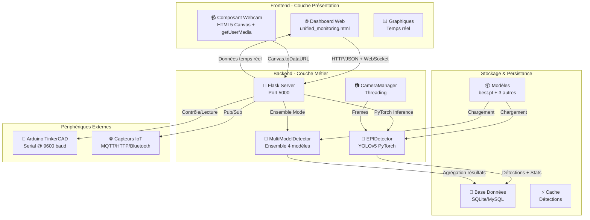

---

## Architecture couche par couche

### 1. Couche Présentation (Frontend)

**Fichier principal :** [templates/unified_monitoring.html](templates/unified_monitoring.html)

#### Composants

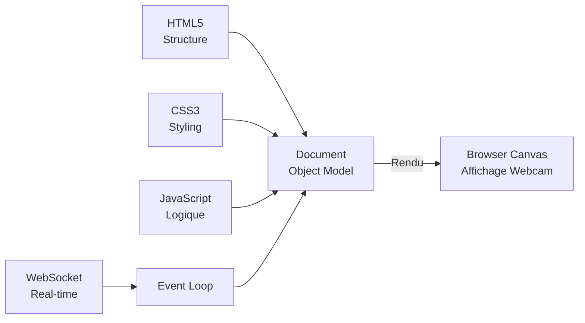

**Responsabilités :**

| Composant | Rôle | Implémentation |
|-----------|------|-----------------|
| **HTML Canvas** | Affichage vidéo webcam | getUserMedia API |
| **JavaScript** | Capture frames & envoi API | fetch() @ 30 FPS |
| **Graphiques** | Statistiques temps réel | Chart.js |
| **Contrôles** | Démarrage/arrêt caméra | Boutons interactifs |
| **Configuration Arduino** | Panel de configuration | Modals Bootstrap |

#### Flow JavaScript

```javascript
// 1. Initialisation
navigator.mediaDevices.getUserMedia({video: true})
    .then(stream => video.srcObject = stream)

// 2. Boucle de capture
setInterval(async () => {
    const canvas = captureFrame(video);
    const imageBase64 = canvas.toDataURL('image/jpeg');
    
    // 3. Envoi à l'API
    const result = await fetch('/api/detect', {
        method: 'POST',
        body: JSON.stringify({image: imageBase64})
    });
    
    // 4. Mise à jour interface
    const detections = await result.json();
    updateDashboard(detections);
}, 33);  // ~30 FPS
```

---

### 2. Couche Application (Backend)

**Fichier principal :** [app/main.py](app/main.py)

#### Framework et composants

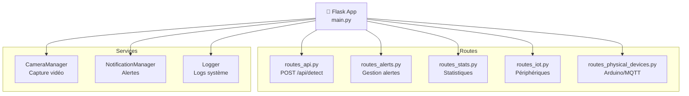

#### Points d'entrée principaux

| Route | Méthode | Fonction |
|-------|---------|----------|
| `/api/detect` | POST | Détection sur image/webcam |
| `/api/stats` | GET | Statistiques détections |
| `/api/models/list` | GET | Liste des modèles |
| `/api/models/compare` | POST | Comparaison multi-modèles |
| `/api/alerts` | GET/POST | Gestion alertes |
| `/api/physical/test` | POST | Test périphériques |

---

### 3. Couche Détection (Modèles IA)

**Fichiers :** [app/detection.py](app/detection.py), [app/multi_model_detector.py](app/multi_model_detector.py)

#### Schéma détection YOLOv5

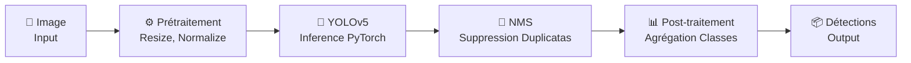

**Classes détectées :**
```
helmet    → Casques (classe 0)
glasses   → Lunettes (classe 1)
person    → Personnes (classe 2)
vest      → Gilets (classe 3)
boots     → Bottes (classe 4)
```

#### Modèles disponibles

| Modèle | Poids | Description |
|--------|-------|-------------|
| `best.pt` | 1.0 | Principal (meilleure précision) |
| `epi_detection_session_003.pt` | 0.8 | Session 3 |
| `epi_detection_session_004.pt` | 0.9 | Session 4 (haute confiance) |
| `epi_detection_session_005.pt` | 0.85 | Session 5 |

#### Configuration détection

```python
# Seuils de confiance
CONFIDENCE_THRESHOLD = 0.5   # 50% confiance minimum
IOU_THRESHOLD = 0.65         # IoU pour NMS
MAX_DETECTIONS = 300         # Max détections/image

# Performance
USE_OPENVINO = False         # Accélération Intel (optionnel)
ENABLE_HALF_PRECISION = True # FP16 pour GPU
```

---

### 4. Couche Données (Base de Données)

**Fichier :** [app/database_unified.py](app/database_unified.py)

#### Modèle de données

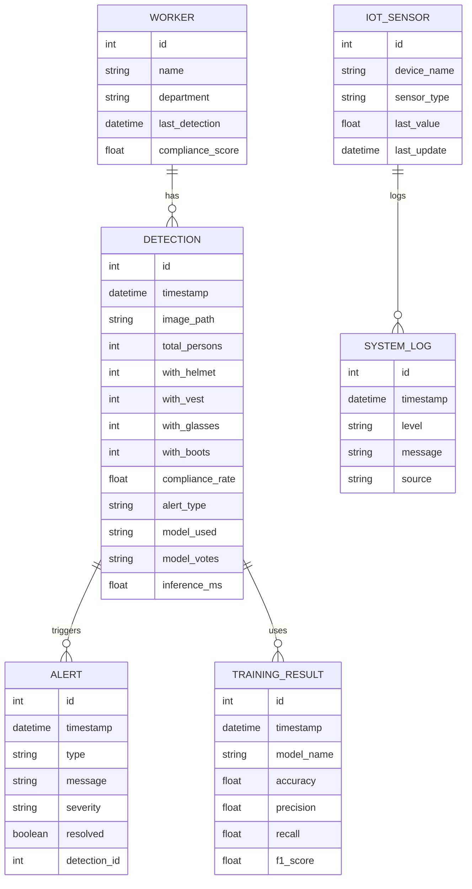

#### Tables principales

| Table | Rôle | Fréquence accès |
|-------|------|-----------------|
| **Detection** | Enregistre chaque détection | ⭐⭐⭐⭐⭐ (High) |
| **Alert** | Alertes générées | ⭐⭐⭐ (Medium) |
| **Worker** | Informations personnel | ⭐⭐ (Low) |
| **TrainingResult** | Résultats entraînement | ⭐ (Very low) |
| **IoTSensor** | Données capteurs IoT | ⭐⭐⭐⭐ (High) |
| **SystemLog** | Logs système | ⭐⭐ (Low) |

---

## Flux de données

### 1. Flux de détection en temps réel (Webcam)

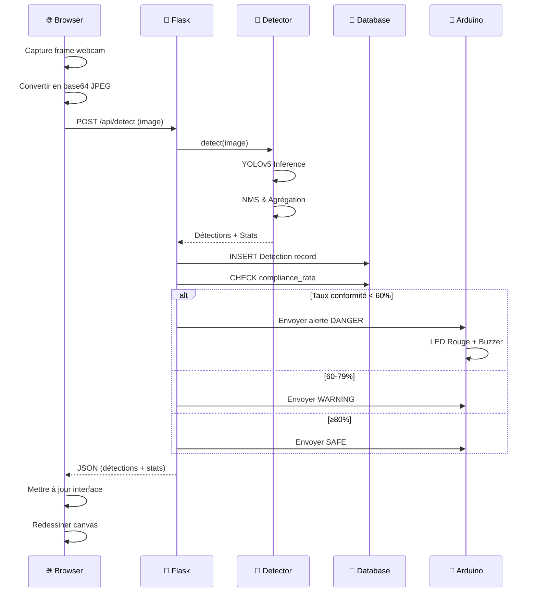

### 2. Flux d'entraînement du modèle

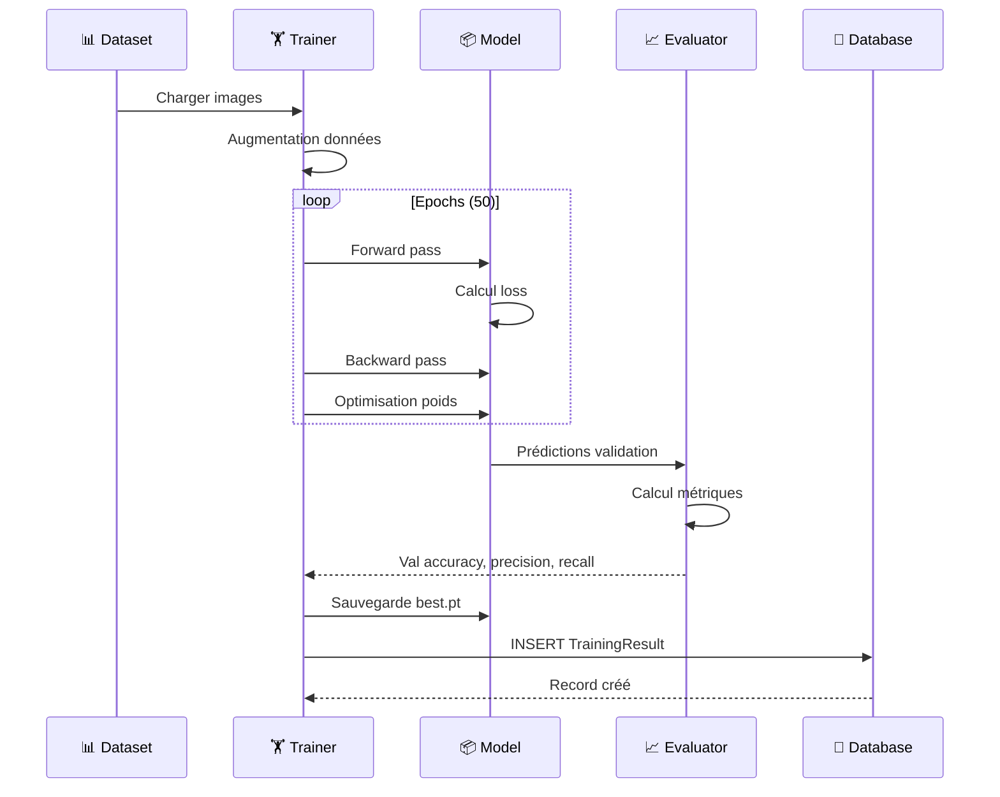

### 3. Flux d'alerte et notification

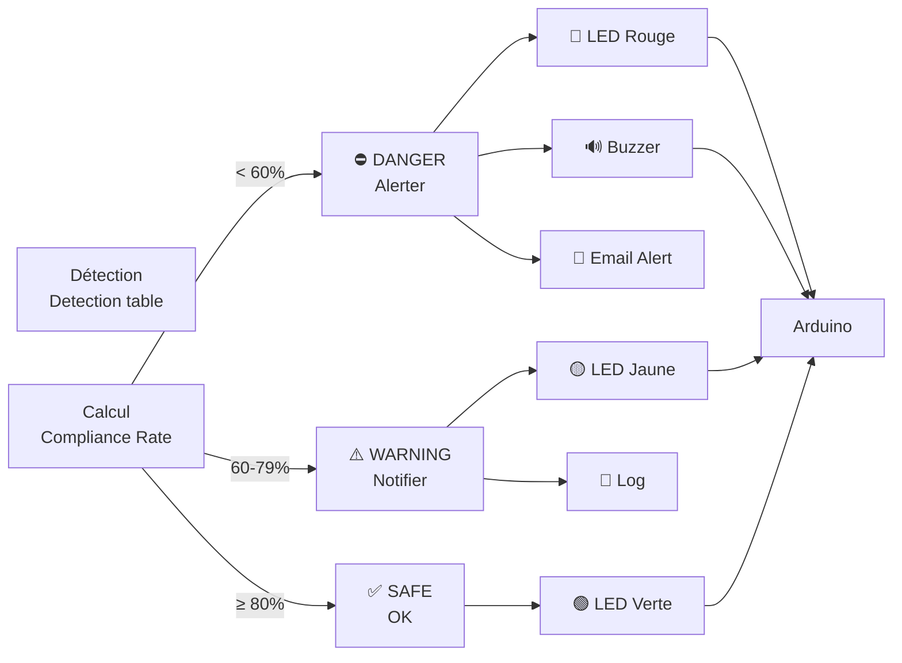

---

## Conception modulaire

### Structure des fichiers Python

```
app/
├── __init__.py                      # Initialisation package
├── main.py                          # Point d'entrée Flask
├── config.py                        # Configuration globale
├── constants.py                     # Constantes (classes, couleurs)
├── logger.py                        # Logging système
│
├── 📊 Détection & Modèles
│   ├── detection.py                 # EPIDetector (YOLOv5 simple)
│   ├── multi_model_detector.py      # MultiModelDetector (ensemble)
│   ├── onnx_detector.py             # Détecteur ONNX (optionnel)
│   └── hardware_optimizer.py        # Accélération matérielle
│
├── 💾 Base de Données
│   ├── database_unified.py          # Modèles SQLAlchemy
│   ├── database.py                  # DB originale
│   ├── db_manager.py                # Gestion migrations
│   └── sync_databases.py            # Sync SQLite ↔ MySQL
│
├── 📡 API & Routes
│   ├── routes_api.py                # Routes /api/detect, /api/stats
│   ├── routes_alerts.py             # Routes alertes
│   ├── routes_stats.py              # Routes statistiques
│   ├── routes_iot.py                # Routes IoT
│   ├── routes_physical_devices.py   # Routes Arduino/MQTT/HTTP
│   ├── routes_notifications.py      # Routes notifications
│   ├── dashboard.py                 # Routes dashboard
│
├── 🎥 Capture Vidéo
│   ├── camera_options.py            # Manager webcam
│   └── audio_manager.py             # Audio pour alertes
│
├── ⚙️ Services
│   ├── notifications.py             # Email/SMS/Push
│   ├── pdf_export.py                # Export PDF
│   ├── powerbi_export.py            # Export Power BI
│   ├── alert_manager.py             # Gestion alertes
│   ├── training_logger.py           # Logs entraînement
│
├── 🔌 Périphériques
│   ├── tinkercad_sim.py             # Simulation Arduino
│   ├── arduino_integration.py       # Communication série
│   └── simulators/                  # Autres simulateurs
│
└── 📚 Utilitaires
    └── utils.py                     # Fonctions communes
```

### Dépendances principales

```
📦 Flask (2.3+)              → Framework web
📦 PyTorch (2.0+)            → Deep Learning
📦 Ultralytics YOLOv5        → Détection objets
📦 OpenCV (4.8+)             → Traitement image
📦 SQLAlchemy (2.0+)         → ORM base de données
📦 Flask-SocketIO            → WebSocket temps réel
📦 Pillow                    → Traitement image
📦 NumPy                     → Calculs matriciels
📦 pandas                    → Manipulation données
📦 reportlab                 → Export PDF
📦 pyserial                  → Communication Arduino
📦 paho-mqtt                 → MQTT (optionnel)
```

---

## Intégration base de données

### Schéma table Detection

```sql
CREATE TABLE detection (
    id INTEGER PRIMARY KEY,
    timestamp DATETIME DEFAULT CURRENT_TIMESTAMP,
    image_path VARCHAR(200),
    
    -- Détections
    total_persons INTEGER,
    with_helmet INTEGER,
    with_vest INTEGER,
    with_glasses INTEGER,
    with_boots INTEGER,
    
    -- Métriques
    compliance_rate FLOAT,
    alert_type VARCHAR(50),
    
    -- Traçabilité modèles
    model_used VARCHAR(100),
    model_votes JSON,
    inference_ms FLOAT,
    
    -- Index pour performance
    INDEX idx_timestamp (timestamp),
    INDEX idx_alert_type (alert_type)
);
```

### Requêtes principales

```python
# Obtenir détections du jour
detections_today = Detection.query.filter(
    Detection.timestamp >= datetime.today()
).order_by(Detection.timestamp.desc())

# Taux de conformité moyen par jour
avg_compliance = db.session.query(
    func.date(Detection.timestamp),
    func.avg(Detection.compliance_rate)
).group_by(func.date(Detection.timestamp))

# Alertes non résolues
unresolved_alerts = Alert.query.filter_by(
    resolved=False
).order_by(Alert.timestamp.desc())
```

---

## Système de détection

### EPIDetector : Détection simple YOLOv5

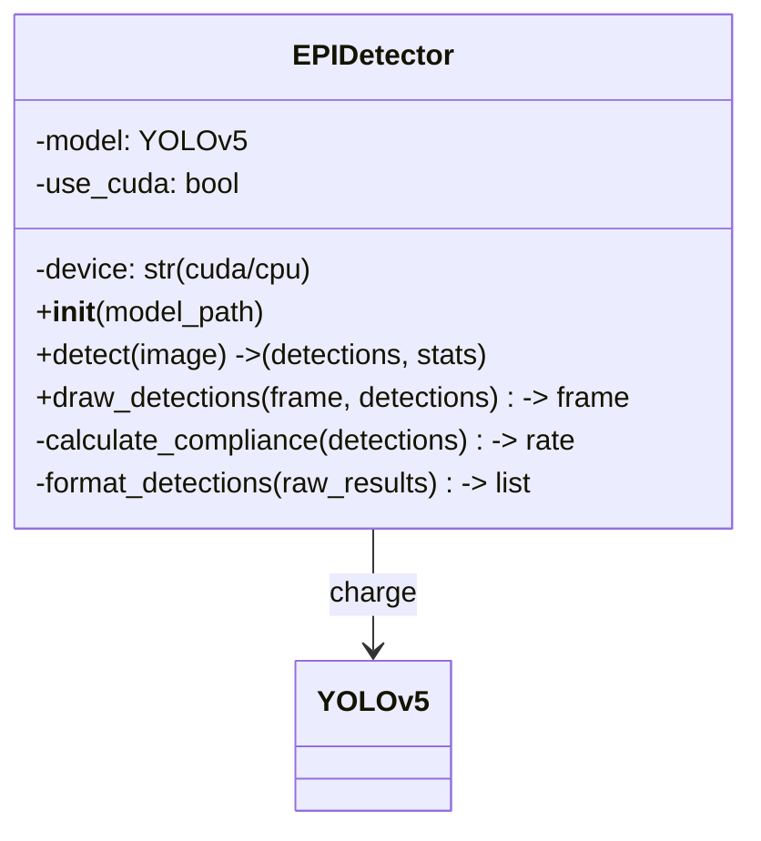

**Pseudo-code :**

```python
class EPIDetector:
    def detect(self, image):
        # 1. Prétraitement
        image_rgb = cv2.cvtColor(image, cv2.COLOR_BGR2RGB)
        
        # 2. Inférence YOLOv5
        results = self.model(image_rgb)
        
        # 3. Extraction détections
        detections = []
        for *box, conf, cls in results.xyxy[0].cpu().numpy():
            class_name = CLASS_NAMES[int(cls)]
            detections.append({
                'class': class_name,
                'confidence': float(conf),
                'box': [int(x) for x in box]
            })
        
        # 4. Calcul conformité
        compliance_rate = self.calculate_compliance(detections)
        
        # 5. Stats
        stats = {
            'total_persons': len(detections),
            'with_helmet': count_by_class(detections, 'helmet'),
            'compliance_rate': compliance_rate,
            'alert_type': get_alert_type(compliance_rate)
        }
        
        return detections, stats
```

### MultiModelDetector : Ensemble 4 modèles

```mermaid
classDiagram
    class MultiModelDetector {
        -models: dict {name: model}
        -weights: dict {name: weight}
        -ensemble_strategy: str
        +__init__(ensemble_strategy)
        +detect(image, use_ensemble) -> (detections, stats)
        +aggregate_detections(all_detections, weights) -> detections
        +apply_nms(detections) -> filtered_detections
        +weighted_voting(detections, weights) -> voted_detections
    }
    
    MultiModelDetector --> EPIDetector : charge 4×
    MultiModelDetector --> "NMS Aggregation" : utilise
    MultiModelDetector --> "Weighted Voting" : utilise
```

**Stratégies d'agrégation :**

```
┌─────────────────────────────────────────┐
│  4 Modèles → Détections                 │
│  best.pt        (w=1.0)   → 10 détections
│  session_003    (w=0.8)   → 9 détections
│  session_004    (w=0.9)   → 11 détections
│  session_005    (w=0.85)  → 9 détections
└─────────────────────────────────────────┘
         ↓
    STRATÉGIE 1: WEIGHTED VOTING
    └─ Vote pondéré pour chaque détection
       Consensus: min 2 modèles d'accord
       Conf moyenne: 0.85
       
    STRATÉGIE 2: UNION NMS
    └─ Fusion toutes les détections
       Application NMS (IoU > 0.65)
       Résultat: ~12 détections conservées
       
    STRATÉGIE 3: AVERAGE
    └─ Moyenne des confidences
       Détections identiques fusionnées
       Résultat: ~10 détections finales
```

---

## Intégration périphériques

### Architecture Arduino TinkerCAD

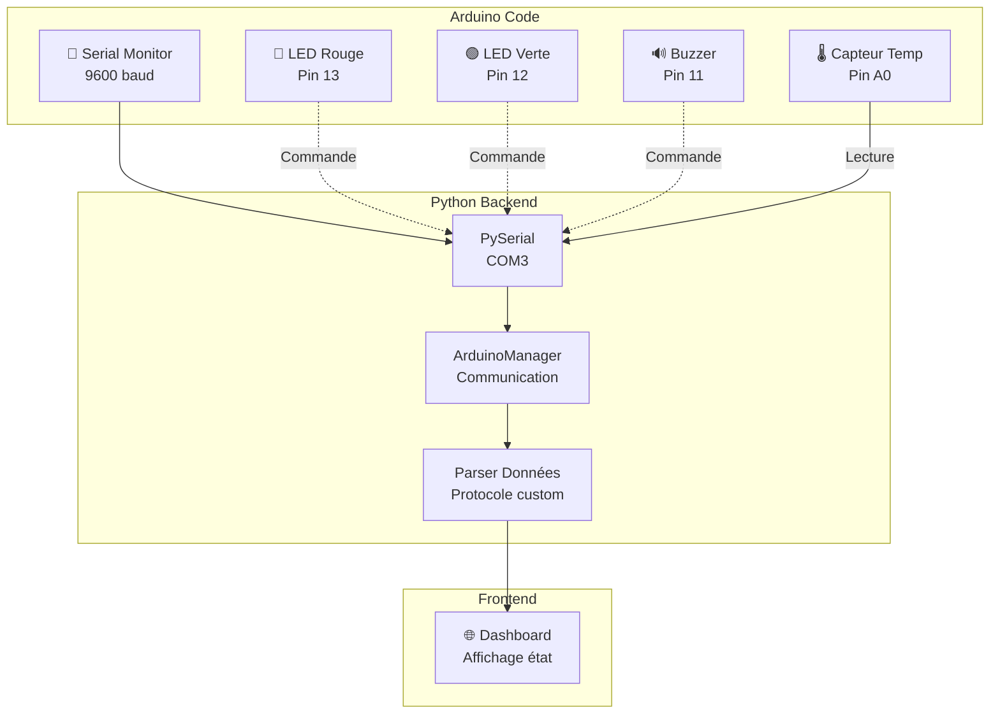

### Protocole de communication

**Format :**
```
Arduino → Python:
  [SENSOR] temp=25.5,humidity=60
  [MOTION] Motion detected!
  [DETECT] Helmet:✓ Vest:✓ Glasses:✓ Confidence:92%

Python → Arduino:
  C85                 (Conformité 85%)
  LED:GREEN           (Allumer LED verte)
  BUZZER:ON           (Activer buzzer)
  DETECT:helmet=1,vest=1,glasses=1,confidence=92
```

**États LED :**

```python
def set_led_state(compliance_rate):
    if compliance_rate >= 80:
        return "LED:GREEN"      # ✅ Conforme
    elif 60 <= compliance_rate < 80:
        return "LED:YELLOW"     # ⚠️ Attention
    else:
        return "LED:RED"        # ❌ Non conforme
```

### Intégration IoT multi-protocoles

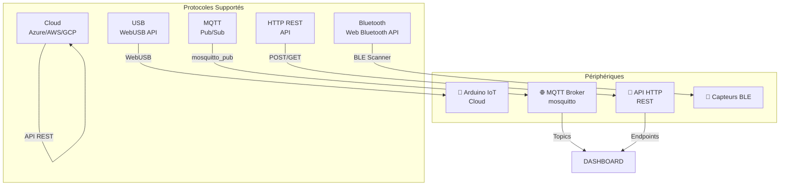

---

## Flux de détection temps réel

### Diagramme d'activité complet

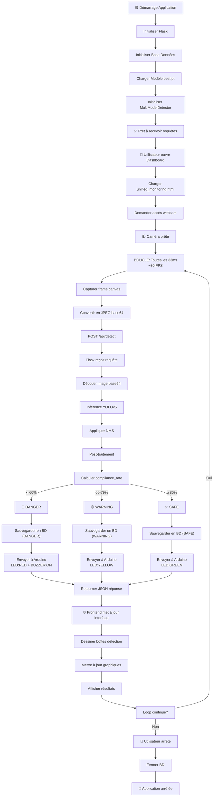

---

## Gestion des états

### Machine à états de conformité

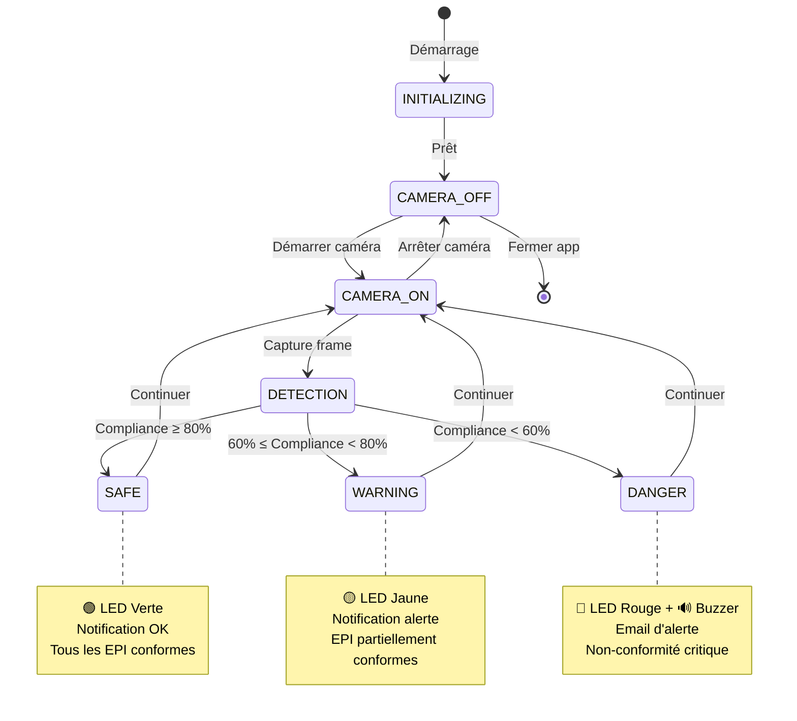

### Machine à états d'alerte

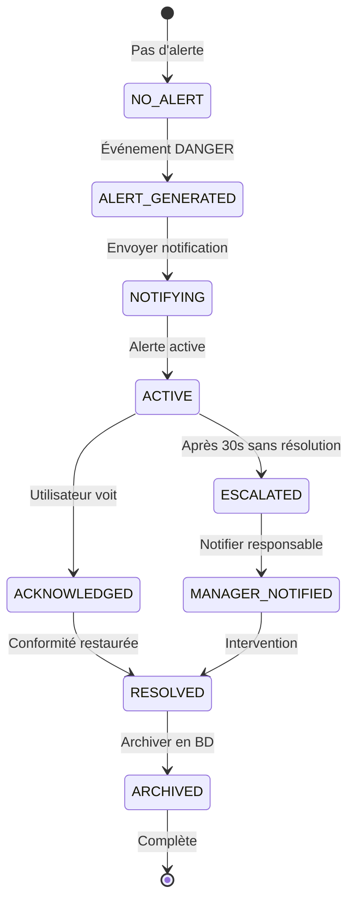

---

## Diagrammes de composants avancés

### Interaction système complet

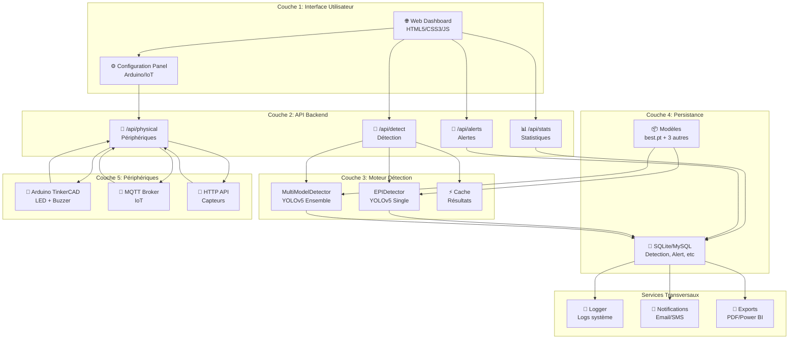

---

## 11. Architecture Système Détaillée

### Infrastructure Matérielle et Logicielle

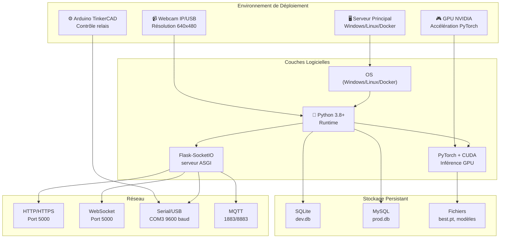

### Stack Technologique Complet

| Couche | Technologie | Rôle | Version |
|--------|-------------|------|---------|
| **Langage** | Python | Logique métier | 3.8+ |
| **Framework Web** | Flask | Serveur HTTP | 2.3+ |
| **Temps réel** | Flask-SocketIO | Communication bidirectionnelle | 5.0+ |
| **IA/Vision** | YOLOv5 PyTorch | Détection objets | v6/v7 |
| **Accélération** | CUDA 11/12 | GPU NVIDIA | 11.8+ |
| **BD Développement** | SQLite | Base de données légère | 3.36+ |
| **BD Production** | MySQL | Base de données scalable | 8.0+ |
| **ORM** | SQLAlchemy | Gestion BD | 1.4+ |
| **Sérialisation** | JSON/Pickle | Données/modèles | - |
| **Frontend** | HTML5/CSS3/JS | Dashboard | ES6 |
| **Graphiques** | Chart.js | Visualisation temps réel | 3.9+ |
| **Matériel** | Arduino | Microcontrôleur | TinkerCAD |
| **Communication Série** | PySerial | COM3 @ 9600 baud | 3.5+ |
| **IoT** | paho-mqtt | Pub/Sub MQTT | 1.6+ |
| **Conteneurisation** | Docker | Déploiement | 20.10+ |

---

## 12. Diagrammes de Cas d'Utilisation (Use Cases)

### Cas d'usage Système Complet

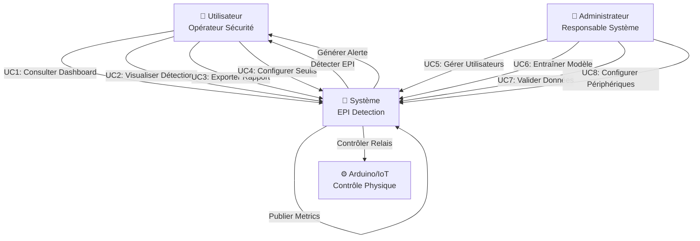

### Détails des Cas d'Usage Principaux

#### UC1: Consulter Dashboard Temps Réel

```mermaid
graph LR
    A["Opérateur <br/>accède interface"] -->|HTTP GET| B["Flask<br/>Charge HTML"]
    B -->|HTML + CSS + JS| C["Navigateur<br/>Affiche Dashboard"]
    C -->|WebSocket<br/>subscribe"] D["Server<br/>SocketIO"]
    D -->|Detection JSON<br/>toutes 100ms| C
    C -->|Canvas<br/>Affichage webcam| E["User<br/>Consulte détections"]
```

#### UC2: Déclencher Alerte Conformité

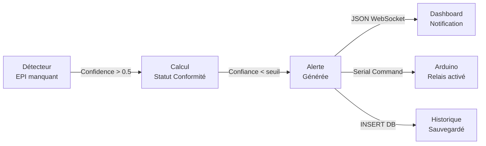

#### UC3: Entraîner Nouveau Modèle

```mermaid
graph LR
    A["Admin<br/>Upload Dataset"] -->|Fichiers ZIP| B["Backend<br/>Extraction"]
    B -->|Augmentation| C["Dataset<br/>Augmenté"]
    C -->|YOLOv5 train| D["Modèle<br/>Entraîné"]
    D -->|Validation| E["Métriques<br/>mAP > 0.85?"]
    E -->|Oui| F["Sauvegarde<br/>best.pt"]
    E -->|Non| G["Retour User<br/>Réessayer"]
```

---

## 13. Diagrammes de Classe (Modèle Objet)

### Architecture Orientée Objet

```mermaid
classDiagram
    class EPIDetector {
        -model: YOLOv5Model
        -conf_threshold: float
        -iou_threshold: float
        -device: str
        +load_model(model_path: str)
        +detect(frame: ndarray): DetectionResult
        +preprocess(frame: ndarray): Tensor
        +postprocess(predictions: Tensor): List~Box~
    }
    
    class MultiModelDetector {
        -detectors: List~EPIDetector~
        -weights: List~float~
        -voting_strategy: str
        +add_detector(detector: EPIDetector, weight: float)
        +detect_ensemble(frame: ndarray): AggregatedResult
        +vote_predictions(predictions: List~List~Box~~): Box
    }
    
    class DetectionResult {
        -boxes: List~Box~
        -confidences: List~float~
        -class_names: List~str~
        -frame_metadata: dict
        -timestamp: datetime
        +get_epi_status(): str
        +to_json(): str
        +to_dict(): dict
    }
    
    class Box {
        -x1: int
        -y1: int
        -x2: int
        -y2: int
        -class_id: int
        -confidence: float
        +area(): int
        +iou(other: Box): float
        +to_json(): str
    }
    
    class CameraManager {
        -source: str
        -cap: VideoCapture
        -frame_queue: Queue
        -running: bool
        +start()
        +get_frame(): ndarray
        +stop()
        +is_alive(): bool
    }
    
    class DatabaseManager {
        -session: Session
        -engine: Engine
        +insert_detection(result: DetectionResult)
        +get_statistics(date_range: tuple): Statistics
        +export_report(date_range: tuple): str
        +query_detections(filters: dict): List~Detection~
    }
    
    class AlertManager {
        -thresholds: dict
        -arduino_controller: SerialController
        -mqtt_client: MQTTClient
        +check_conformity(result: DetectionResult): bool
        +trigger_alert(alert_type: str, level: int)
        +notify_user(message: str, channel: str)
    }
    
    class SerialController {
        -port: str
        -baudrate: int
        -serial: Serial
        +connect()
        +send_command(cmd: str)
        +read_response(): str
        +disconnect()
    }
    
    EPIDetector -->|utilise| Box
    MultiModelDetector -->|contient| EPIDetector
    DetectionResult -->|contient| Box
    CameraManager -->|produit| ndarray
    DatabaseManager -->|stocke| DetectionResult
    AlertManager -->|utilise| SerialController
    
    EPIDetector --|détecte| DetectionResult
    MultiModelDetector --|agrège| DetectionResult
```

### Hiérarchie Héritage (Modèles BD)

```mermaid
classDiagram
    class BaseModel {
        -id: int
        -created_at: datetime
        -updated_at: datetime
    }
    
    class Detection {
        -frame_id: int
        -class_name: str
        -confidence: float
        -x_min: int
        -y_min: int
        -x_max: int
        -y_max: int
    }
    
    class Alert {
        -detection_id: int
        -alert_type: str
        -severity: int
        -message: str
        -is_resolved: bool
    }
    
    class Statistics {
        -date: date
        -total_frames: int
        -detections_count: int
        -conformity_rate: float
        -avg_confidence: float
    }
    
    class Model {
        -name: str
        -path: str
        -version: str
        -map_score: float
        -is_active: bool
    }
    
    BaseModel <|-- Detection
    BaseModel <|-- Alert
    BaseModel <|-- Statistics
    BaseModel <|-- Model
    
    Detection -->|génère| Alert
    Detection -->|contribue à| Statistics
```

---

## 14. Diagrammes de Séquence (Flux Transactionnels)

### Séquence 1: Détection Temps Réel (Flux Principal)

```mermaid
sequenceDiagram
    participant WEB as 🌐 Dashboard<br/>Frontend
    participant FLASK as 🐍 Flask Server<br/>Backend
    participant CAM as 📷 CameraManager<br/>Thread
    participant DETECT as 🎯 EPIDetector<br/>YOLOv5
    participant DB as 💾 Database<br/>SQLite
    participant ALERT as 🚨 AlertManager<br/>Notifications
    
    WEB->>FLASK: GET /api/stream (Subscribe WebSocket)
    FLASK->>CAM: read_frame()
    CAM-->>FLASK: frame (numpy array)
    FLASK->>DETECT: detect(frame)
    activate DETECT
        DETECT->>DETECT: preprocess (640x480)
        DETECT->>DETECT: YOLOv5 inference (GPU)
        DETECT->>DETECT: postprocess (NMS)
    deactivate DETECT
    DETECT-->>FLASK: DetectionResult {boxes, confidences}
    
    FLASK->>DB: insert_detection(result)
    activate DB
        DB->>DB: session.add(Detection)
        DB->>DB: session.commit()
    deactivate DB
    
    FLASK->>ALERT: check_conformity(result)
    activate ALERT
        ALERT->>ALERT: Confidence < threshold?
        ALERT->>ALERT: Generate alert_json
        alt Alert Triggered
            ALERT->>FLASK: trigger_notification()
        end
    deactivate ALERT
    
    FLASK->>WEB: WebSocket emit({detections, stats})
    WEB->>WEB: Update Canvas + Chart
    WEB-->>WEB: Affiche détections en temps réel
    
    Note over FLASK,CAM: Boucle chaque 33ms (30 FPS)
```

### Séquence 2: Entraînement de Modèle

```mermaid
sequenceDiagram
    participant ADMIN as 👨‍💼 Administrateur
    participant FLASK as 🐍 Flask Server
    participant STORAGE as 📦 Stockage Fichiers
    participant TRAIN as 🤖 YOLOv5 Trainer
    participant VAL as ✅ Validateur
    participant DB as 💾 Database
    
    ADMIN->>FLASK: POST /api/train (form + ZIP dataset)
    FLASK->>STORAGE: extract_dataset()
    FLASK->>STORAGE: augment_images()
    FLASK->>STORAGE: split_train_val()
    
    FLASK->>TRAIN: yolov5.train(epochs=100, batch=32, device='0')
    activate TRAIN
        TRAIN->>TRAIN: DataLoader creation
        loop Epochs
            TRAIN->>TRAIN: Forward pass
            TRAIN->>TRAIN: Loss computation
            TRAIN->>TRAIN: Backward pass
            TRAIN->>TRAIN: Optimizer step
            TRAIN->>TRAIN: Save checkpoint
        end
        TRAIN-->>FLASK: Training complete, best.pt
    deactivate TRAIN
    
    FLASK->>VAL: validate_model(best.pt, val_dataset)
    activate VAL
        VAL->>VAL: Calcul mAP
        VAL->>VAL: Calcul Precision/Recall
        VAL-->>FLASK: {mAP: 0.87, precision: 0.92}
    deactivate VAL
    
    FLASK->>DB: INSERT Model(name, path, mAP)
    FLASK->>ADMIN: Retour {status: success, metrics}
    
    Note over ADMIN,TRAIN: Durée: 30min - 2h selon GPU
```

### Séquence 3: Alerte et Contrôle Arduino

```mermaid
sequenceDiagram
    participant DETECT as 🎯 Détecteur
    participant FLASK as 🐍 Flask
    participant ALERT as 🚨 AlertManager
    participant SERIAL as 🔌 SerialController
    participant ARDUINO as ⚙️ Arduino
    participant WEB as 🌐 Dashboard
    
    DETECT->>FLASK: DetectionResult (casque = false)
    FLASK->>ALERT: Conformity check
    activate ALERT
        ALERT->>ALERT: EPI missing = true
        ALERT->>ALERT: Generate alert
    deactivate ALERT
    
    ALERT->>SERIAL: send_command("RELAY_ON:1")
    activate SERIAL
        SERIAL->>ARDUINO: Serial @9600 baud
        SERIAL->>SERIAL: wait response (500ms timeout)
    deactivate SERIAL
    
    ARDUINO-->>SERIAL: "OK:RELAY_1_ACTIVATED"
    SERIAL-->>ALERT: Command sent successfully
    
    ALERT->>FLASK: emit WebSocket alert
    FLASK->>WEB: {type: 'CONFORMITY_VIOLATION', severity: 'HIGH'}
    WEB->>WEB: Show red banner + sound alert
    
    rect rgb(200, 150, 150)
        Note over ALERT,ARDUINO: Alerte actif 30 secondes
        ALERT->>ALERT: Timer (30s)
    end
    
    ALERT->>SERIAL: send_command("RELAY_OFF:1")
    SERIAL->>ARDUINO: Serial command
    ARDUINO-->>SERIAL: "OK:RELAY_1_DEACTIVATED"
    
    Note over ALERT,WEB: Alerte fermée
```

### Séquence 4: Export et Rapport

```mermaid
sequenceDiagram
    participant USER as 👤 Utilisateur
    participant FLASK as 🐍 Flask
    participant DB as 💾 Database
    participant EXPORT as 📄 Générateur Rapport
    participant STORAGE as 📦 Fichiers
    
    USER->>FLASK: GET /api/export?format=pdf&date_from=2024-01-01
    FLASK->>DB: Query detections (date_from to date_to)
    activate DB
        DB->>DB: SELECT * FROM detections WHERE created_at >= ?
        DB-->>FLASK: 1500 détections
    deactivate DB
    
    FLASK->>DB: Query statistics (groupby date)
    DB-->>FLASK: {daily_stats: [{date, count, avg_conf},...]}
    
    FLASK->>EXPORT: generate_report(detections, statistics, format='pdf')
    activate EXPORT
        EXPORT->>EXPORT: Render HTML template
        EXPORT->>EXPORT: Tables + Charts
        EXPORT->>EXPORT: Convert HTML → PDF (weasyprint)
        EXPORT->>EXPORT: Signature + Timestamp
    deactivate EXPORT
    
    EXPORT-->>FLASK: rapport_2024-01-01_to_2024-01-31.pdf
    FLASK->>STORAGE: save_file(rapport.pdf)
    FLASK->>USER: Download(rapport.pdf)
    
    Note over USER,STORAGE: Rapport 15 pages générées en 5s
```

---

## 15. Diagramme d'Activité (Flux de Détection Complet)

```mermaid
graph TD
    A["🔴 Démarrage Système"] -->|initialise| B["Charger modèle YOLOv5"]
    B -->|load_model best.pt| C["Modèle chargé en GPU"]
    C -->|success| D["Connecter à BD"]
    D -->|SQLAlchemy session| E["Session active"]
    
    E -->|Lance CameraManager| F["Capture webcam"]
    F -->|30 FPS| G{"Frame valide?"}
    
    G -->|non| Z1["Ignorer frame"]
    Z1 -->|continue| F
    
    G -->|oui| H["Prétraitement<br/>640x480"]
    H -->|normalisation| I["Tensor input"]
    I -->|GPU transfer| J["Inférence YOLOv5"]
    
    J -->|forward pass| K["Prédictions brutes"]
    K -->|NMS filtering| L["Post-traitement"]
    L -->|confidence>0.5| M["Boîtes finales"]
    
    M -->|parse boxes| N{"Détections?"}
    N -->|non| O["Frame vide"]
    O -->|save stats| P["BD: confidence=0"]
    
    N -->|oui| Q["Extraire classes"]
    Q -->|helmet, vest, ...| R["Analyse conformité"]
    R -->|check required EPI| S{"Conformité?"}
    
    S -->|oui| T["Status: OK ✅"]
    T -->|save DB| U["INSERT Detection"]
    U -->|success| V["Emit WebSocket OK"]
    
    S -->|non| W["Status: ALERT ⚠️"]
    W -->|severity HIGH| X["Générer alerte"]
    X -->|Arduino trigger| Y1["Envoyer commande"]
    Y1 -->|Serial @9600| Y2["Relais activé"]
    Y2 -->|30s timer| Y3["Relais désactivé"]
    
    X -->|save DB| Y4["INSERT Alert"]
    Y4 -->|WebSocket broadcast| Y5["Notification user"]
    
    U -->|JSON| Y5
    V -->|periodic refresh| AA["Dashboard mis à jour"]
    Y5 -->|chart updated| AA
    
    AA -->|100ms interval| AB{"Application active?"}
    AB -->|oui| F
    AB -->|non| AC["🟢 Arrêt Système"]
    AC -->|cleanup| AD["Fermer BD"]
    AD -->|save models| AE["Libérer GPU"]
    AE -->|exit| AF["Fin"]
    
    style A fill:#ff4444
    style AC fill:#44ff44
    style AF fill:#44ff44
    style T fill:#44ff44
    style W fill:#ff8844
```

---

## 16. Diagramme de Déploiement (Environnement Physique)

### Infrastructure Complète

```mermaid
graph TB
    subgraph "Couche Présentation"
        CLIENT1["💻 Client PC<br/>Windows/Linux"]
        CLIENT2["📱 Mobile/Tablet<br/>Browser"]
        CLIENT3["🖥️ Poste Sécurité<br/>Dashboard dédié"]
    end
    
    subgraph "Réseau Entreprise"
        ROUTER["🌐 Router/Firewall<br/>Port 5000 ouvert"]
        WIFI["📡 WiFi 5GHz<br/>Limite latence"]
        ETH["🔗 Ethernet<br/>Câblé pour serveur"]
    end
    
    subgraph "Serveur Physique"
        SERVER["🖥️ Serveur EPI Detection<br/>Windows 10/11 ou Linux"]
        GPU["🎮 GPU NVIDIA<br/>RTX 3060+ / A100"]
        SSD["💾 SSD 1TB<br/>OS + Modèles + BD"]
        RAM["💾 RAM 32GB<br/>PyTorch buffers"]
    end
    
    subgraph "Stockage Persistant"
        LOCAL_DB["📊 SQLite (dev)<br/>dev.db 500MB"]
        MYSQL_DB["🗄️ MySQL Server<br/>epi_detection_prod"]
        BACKUP["💾 Sauvegarde<br/>NAS/Cloud"]
    end
    
    subgraph "Périphériques Physiques"
        CAM["📹 Caméra IP<br/>RTSPv2"]
        ARDUINO["⚙️ Arduino + Relais<br/>USB COM3 9600 baud"]
        SENSOR["📊 Capteurs IoT<br/>Zigbee/LoRaWAN"]
    end
    
    subgraph "Réseau Externe"
        MQTT_BROKER["☁️ MQTT Broker<br/>mosquitto:1883"]
        CLOUD["☁️ Cloud Backup<br/>S3/Azure"]
    end
    
    CLIENT1 -->|HTTPS:5000| ROUTER
    CLIENT2 -->|HTTPS:5000| ROUTER
    CLIENT3 -->|HTTPS:5000| ROUTER
    
    ROUTER -->|LAN| ETH
    ROUTER -->|WiFi| WIFI
    ETH -->|connected| SERVER
    WIFI -->|latency < 50ms| SERVER
    
    SERVER -->|utilise| GPU
    SERVER -->|utilise| SSD
    SERVER -->|utilise| RAM
    
    SERVER -->|read/write| LOCAL_DB
    SERVER -->|read/write| MYSQL_DB
    MYSQL_DB -->|nightly backup| BACKUP
    
    CAM -->|RTSP stream| SERVER
    ARDUINO -->|Serial USB| SERVER
    SENSOR -->|HTTP/CoAP| SERVER
    
    SERVER -->|Pub logs| MQTT_BROKER
    SERVER -->|sync| CLOUD
    
    style SERVER fill:#4488ff
    style GPU fill:#88ff44
    style CLIENT1 fill:#ffaa44
    style CAM fill:#ff4444
```

### Conteneurisation Docker

```mermaid
graph TB
    subgraph "Docker Compose Stack"
        MAIN["app:<br/>main container<br/>- Flask<br/>- YOLOv5<br/>- Python 3.8"]
        DB["mysql:<br/>db container<br/>- MySQL 8.0<br/>- Volumes"]
        MQTT["mqtt:<br/>broker container<br/>- Mosquitto<br/>- Auth"]
    end
    
    subgraph "Volumes Partagés"
        V1["models/<br/>best.pt"]
        V2["data/<br/>detections"]
        V3["logs/<br/>app.log"]
    end
    
    subgraph "Réseau Docker"
        NETWORK["epi-network<br/>bridge"]
    end
    
    MAIN -->|connected| NETWORK
    DB -->|connected| NETWORK
    MQTT -->|connected| NETWORK
    
    MAIN -->|mount| V1
    MAIN -->|mount| V2
    MAIN -->|mount| V3
    
    MAIN -->|tcp:3306| DB
    MAIN -->|tcp:1883| MQTT
    
    style MAIN fill:#4488ff
    style DB fill:#ff8844
    style MQTT fill:#88ff44
```

---

## 17. Modèle de Données Détaillé (ERD Complet)

### Schéma Entité-Relation

```mermaid
erDiagram
    MODELS ||--o{ DETECTIONS : generates
    MODELS ||--o{ TRAINING_SESSIONS : tracks
    USERS ||--o{ ALERTS : receives
    USERS ||--o{ TRAINING_SESSIONS : creates
    DETECTIONS ||--o{ ALERTS : triggers
    DETECTIONS ||--o{ STATISTICS : contributes
    ALERTS ||--o{ ALERT_LOGS : records
    PHYSICAL_DEVICES ||--o{ DEVICE_COMMANDS : executes
    CAMERA_STREAMS ||--o{ DETECTIONS : produces

    MODELS {
        int id PK
        string name UK "yolov5_v7_helmet"
        string path "models/best.pt"
        string version "7.0"
        float map_score "0.87"
        float precision "0.92"
        float recall "0.84"
        datetime created_at
        boolean is_active "true"
    }

    USERS {
        int id PK
        string username UK "john_operator"
        string email "john@company.com"
        string password_hash
        string role "OPERATOR|ADMIN"
        boolean active "true"
        datetime created_at
        datetime last_login
    }

    CAMERA_STREAMS {
        int id PK
        string name "Webcam Office 1"
        string source "0|rtsp://..."
        string location "Zone Production A"
        boolean active "true"
        datetime created_at
    }

    DETECTIONS {
        int id PK
        int model_id FK
        int camera_id FK
        string class_name "helmet|vest|boots|glasses"
        float confidence "0.89"
        int bbox_x_min "120"
        int bbox_y_min "150"
        int bbox_x_max "200"
        int bbox_y_max "280"
        boolean is_valid "true"
        datetime detected_at "2024-01-23 14:30:45"
    }

    ALERTS {
        int id PK
        int detection_id FK
        int user_id FK
        string alert_type "MISSING_EPI|CONFIDENCE_LOW"
        int severity "1|2|3" "3=CRITICAL"
        string message "Casque manquant détecté"
        boolean is_resolved "false"
        string resolution_note
        datetime created_at
        datetime resolved_at
    }

    ALERT_LOGS {
        int id PK
        int alert_id FK
        string action "TRIGGERED|ACKNOWLEDGED|RESOLVED"
        string details
        datetime timestamp
    }

    STATISTICS {
        int id PK
        date stat_date "2024-01-23"
        int total_frames "86400"
        int total_detections "1254"
        float conformity_rate "0.96" "%"
        float avg_confidence "0.87"
        int alerts_triggered "8"
        int alerts_resolved "8"
    }

    TRAINING_SESSIONS {
        int id PK
        int model_id FK
        int user_id FK
        string dataset_name "EPI_Dataset_v2"
        int total_images "5000"
        int epochs "100"
        int batch_size "32"
        float final_map "0.87"
        string status "COMPLETED|RUNNING|FAILED"
        datetime started_at
        datetime completed_at
        string notes "Augmentation 8x, mixup enabled"
    }

    PHYSICAL_DEVICES {
        int id PK
        string device_type "ARDUINO|MQTT_SENSOR|RELAY"
        string name "Arduino Relais Zone A"
        string connection_string "COM3|mqtt://broker:1883"
        int baudrate "9600"
        boolean active "true"
        datetime last_heartbeat
        string status "CONNECTED|DISCONNECTED"
    }

    DEVICE_COMMANDS {
        int id PK
        int device_id FK
        string command "RELAY_ON:1|LED_RED|BUZZER_PULSE"
        string status "SENT|EXECUTED|FAILED"
        string response "OK:RELAY_1_ACTIVATED"
        datetime sent_at
        datetime executed_at
        int execution_time_ms "45"
    }
```

### Structure Détaillée des Tables Principales

#### Table DETECTIONS
```
CREATE TABLE detections (
    id INTEGER PRIMARY KEY AUTO_INCREMENT,
    model_id INTEGER NOT NULL,
    camera_id INTEGER,
    class_name VARCHAR(50) NOT NULL,      # helmet, vest, boots, glasses
    confidence FLOAT NOT NULL,             # 0.0-1.0
    bbox_x_min INT,
    bbox_y_min INT,
    bbox_x_max INT,
    bbox_y_max INT,
    frame_hash VARCHAR(64),                # SHA256 pour déduplic
    is_valid BOOLEAN DEFAULT TRUE,
    detected_at DATETIME DEFAULT CURRENT_TIMESTAMP,
    FOREIGN KEY (model_id) REFERENCES models(id),
    INDEX (camera_id),
    INDEX (detected_at),
    INDEX (class_name)
) ENGINE=InnoDB DEFAULT CHARSET=utf8mb4;
```

#### Table ALERTS
```
CREATE TABLE alerts (
    id INTEGER PRIMARY KEY AUTO_INCREMENT,
    detection_id INTEGER NOT NULL,
    user_id INTEGER,
    alert_type ENUM(
        'MISSING_HELMET',
        'MISSING_VEST',
        'MISSING_BOOTS',
        'CONFIDENCE_LOW',
        'DEVICE_OFFLINE'
    ),
    severity INT DEFAULT 1,                # 1=LOW, 2=MEDIUM, 3=HIGH
    message TEXT,
    is_resolved BOOLEAN DEFAULT FALSE,
    resolution_note TEXT,
    created_at DATETIME DEFAULT CURRENT_TIMESTAMP,
    resolved_at DATETIME,
    FOREIGN KEY (detection_id) REFERENCES detections(id),
    FOREIGN KEY (user_id) REFERENCES users(id),
    INDEX (created_at),
    INDEX (is_resolved),
    INDEX (alert_type)
) ENGINE=InnoDB DEFAULT CHARSET=utf8mb4;
```

#### Table STATISTICS
```
CREATE TABLE statistics (
    id INTEGER PRIMARY KEY AUTO_INCREMENT,
    stat_date DATE NOT NULL UNIQUE,
    total_frames INT DEFAULT 0,
    total_detections INT DEFAULT 0,
    conformity_rate FLOAT,                 # %
    avg_confidence FLOAT,                  # 0.0-1.0
    alerts_triggered INT DEFAULT 0,
    alerts_resolved INT DEFAULT 0,
    peak_detections_per_hour INT,
    created_at DATETIME DEFAULT CURRENT_TIMESTAMP,
    INDEX (stat_date)
) ENGINE=InnoDB DEFAULT CHARSET=utf8mb4;
```

#### Table TRAINING_SESSIONS
```
CREATE TABLE training_sessions (
    id INTEGER PRIMARY KEY AUTO_INCREMENT,
    model_id INTEGER,
    user_id INTEGER NOT NULL,
    dataset_name VARCHAR(255) NOT NULL,
    total_images INT,
    epochs INT DEFAULT 100,
    batch_size INT DEFAULT 32,
    learning_rate FLOAT DEFAULT 0.001,
    augmentation_level INT,                # 0=none, 1=light, 8=heavy
    final_map FLOAT,
    final_precision FLOAT,
    final_recall FLOAT,
    status ENUM('QUEUED','RUNNING','COMPLETED','FAILED') DEFAULT 'QUEUED',
    started_at DATETIME,
    completed_at DATETIME,
    training_time_minutes INT,
    gpu_used VARCHAR(50),                  # RTX 3060, A100
    notes TEXT,
    FOREIGN KEY (model_id) REFERENCES models(id),
    FOREIGN KEY (user_id) REFERENCES users(id),
    INDEX (status),
    INDEX (started_at)
) ENGINE=InnoDB DEFAULT CHARSET=utf8mb4;
```

### Requêtes SQL Fréquentes

#### Q1: Détections du jour par classe
```sql
SELECT 
    class_name,
    COUNT(*) as count,
    AVG(confidence) as avg_confidence,
    HOUR(detected_at) as hour
FROM detections
WHERE detected_at >= CURDATE()
GROUP BY class_name, HOUR(detected_at)
ORDER BY hour DESC;
```

#### Q2: Taux de conformité par période
```sql
SELECT 
    stat_date,
    total_detections,
    conformity_rate,
    alerts_triggered,
    alerts_resolved
FROM statistics
WHERE stat_date BETWEEN DATE_SUB(CURDATE(), INTERVAL 30 DAY) 
  AND CURDATE()
ORDER BY stat_date DESC;
```

#### Q3: Alertes non résolues critiques
```sql
SELECT 
    a.id, d.class_name, a.message, 
    a.created_at, u.username
FROM alerts a
JOIN detections d ON a.detection_id = d.id
LEFT JOIN users u ON a.user_id = u.id
WHERE a.is_resolved = FALSE 
  AND a.severity = 3
ORDER BY a.created_at DESC
LIMIT 20;
```

#### Q4: Performances par modèle
```sql
SELECT 
    m.name,
    COUNT(d.id) as detections_count,
    AVG(d.confidence) as avg_confidence,
    (SELECT COUNT(*) FROM alerts 
     WHERE detection_id IN (SELECT id FROM detections WHERE model_id=m.id)
    ) as alerts_count
FROM models m
LEFT JOIN detections d ON m.id = d.model_id
GROUP BY m.id, m.name;
```

---

## Résumé conception

### Points forts

| Aspect | Description |
|--------|------------|
| **Modularité** | Composants indépendants, faciles à tester |
| **Scalabilité** | Support SQLite pour dev, MySQL pour prod |
| **Performance** | Multi-threading, cache, accélération GPU |
| **Extensibilité** | 6 protocoles IoT, multi-modèles ensemble |
| **Robustesse** | Gestion erreurs, logging complet, fallback |
| **Real-time** | WebSocket, détection 20-30 FPS, UI temps réel |

### Technologies clés

- **Framework :** Flask + Flask-SocketIO
- **IA/Vision :** YOLOv5 PyTorch + OpenCV
- **Frontend :** HTML5 Canvas + Chart.js
- **BD :** SQLAlchemy + SQLite/MySQL
- **Périphériques :** PySerial, paho-mqtt
- **Déploiement :** Docker, docker-compose

### Fichiers de référence

| Fichier | Lignes | Rôle |
|---------|--------|------|
| app/main.py | 1240 | Point d'entrée, routes principales |
| app/detection.py | 232 | Détecteur YOLOv5 |
| app/multi_model_detector.py | 400+ | Ensemble 4 modèles |
| app/routes_api.py | 754 | API /api/detect, /api/stats |
| templates/unified_monitoring.html | 2000+ | Dashboard interactif |
| app/database_unified.py | 300+ | Modèles BD unifiés |
| app/routes_physical_devices.py | 450+ | Communication Arduino/IoT |

---

## Conclusion

Le système **EPI Detection** présente une architecture **robuste, modulaire et scalable** combinant:
- 🎯 Deep Learning (YOLOv5) haute performance
- 🌐 API REST moderne avec WebSocket
- 💾 Stockage flexible (SQLite/MySQL)
- 🔌 Intégration matériel complète (Arduino + IoT)
- 📊 Dashboard temps réel intuitif

Cette conception permet **détection industrielle temps réel** de conformité EPI avec **alertes automatiques** et **traçabilité complète** pour rapports de sécurité.

