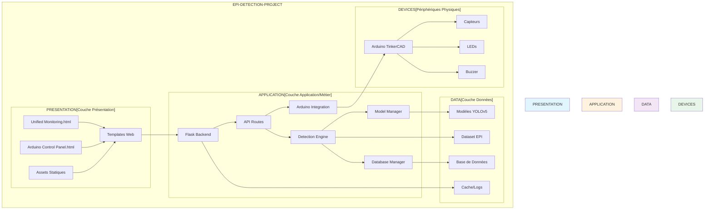
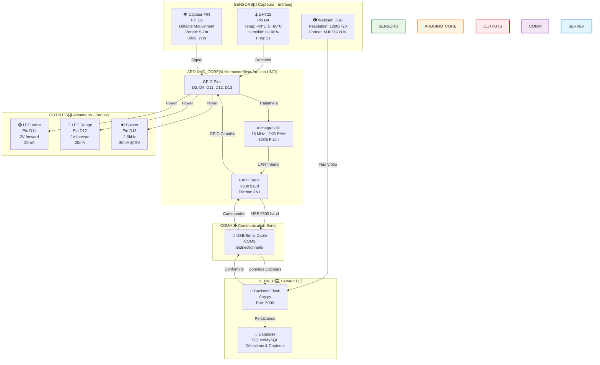
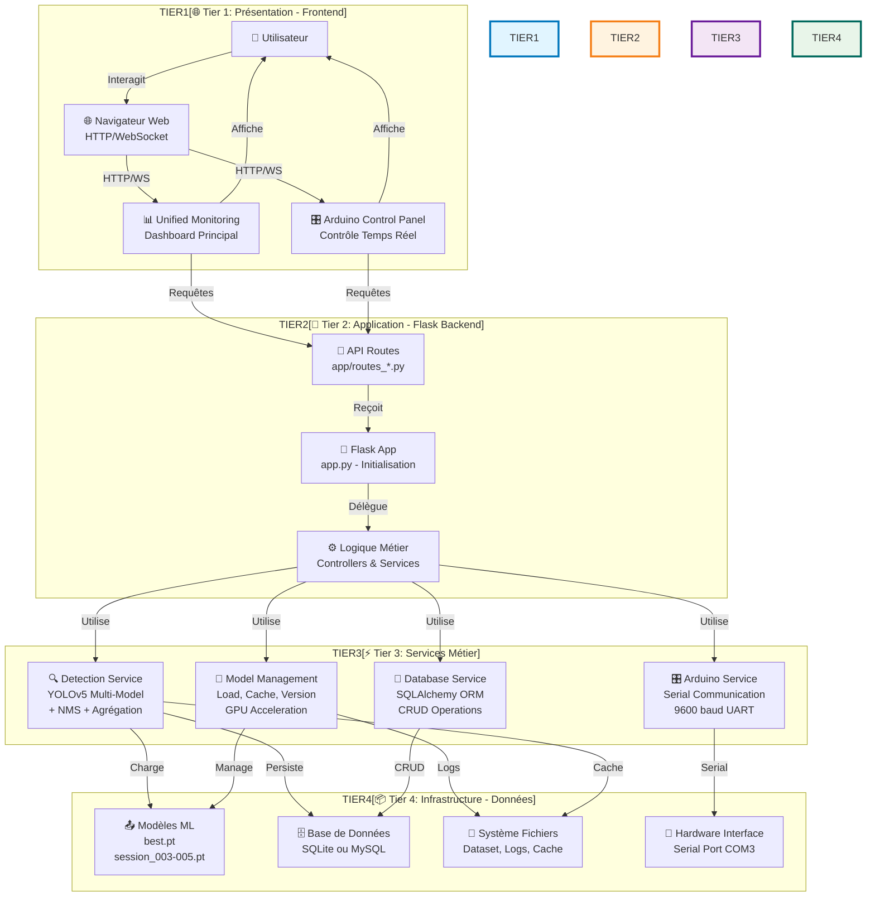
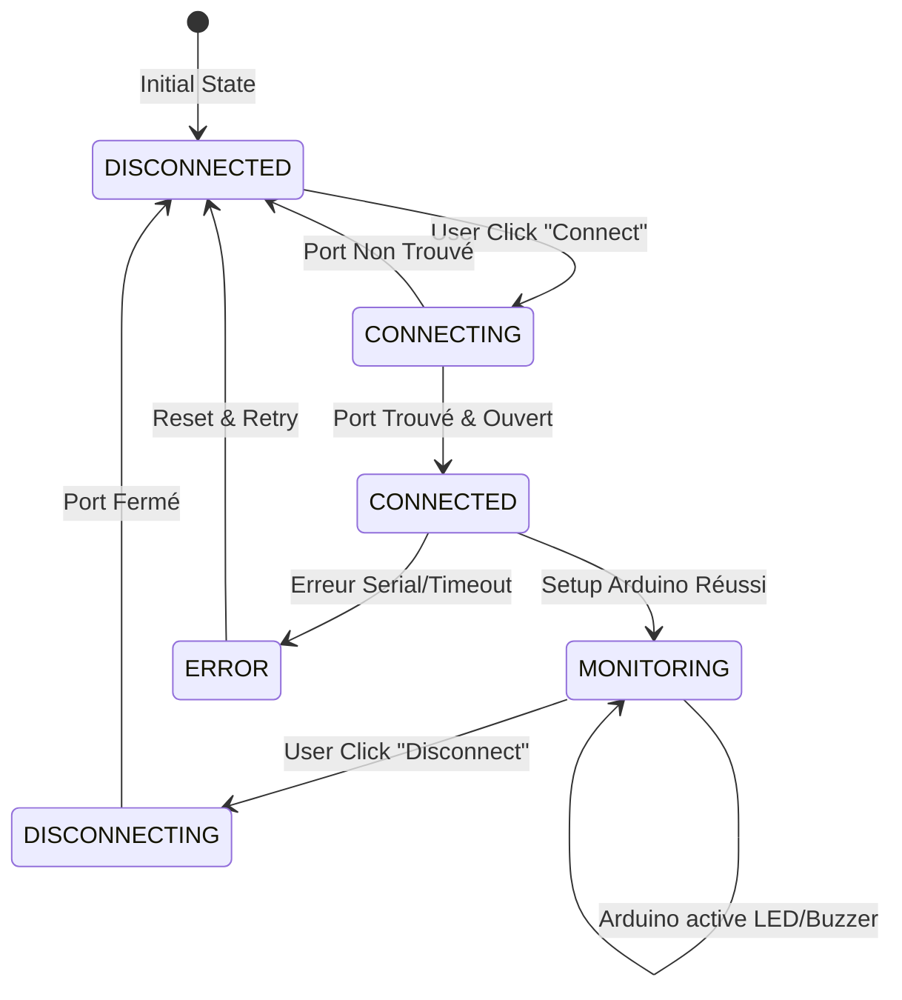
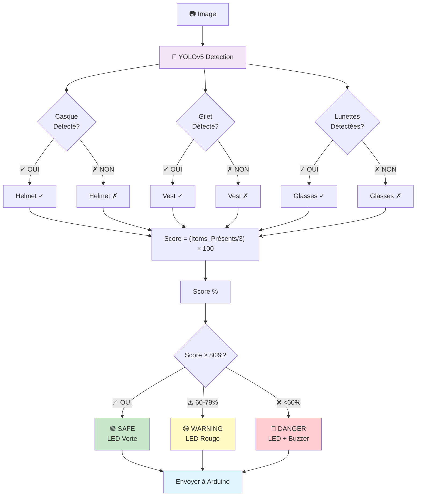
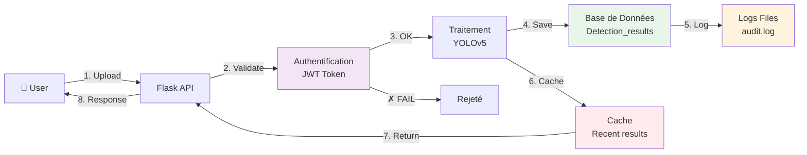
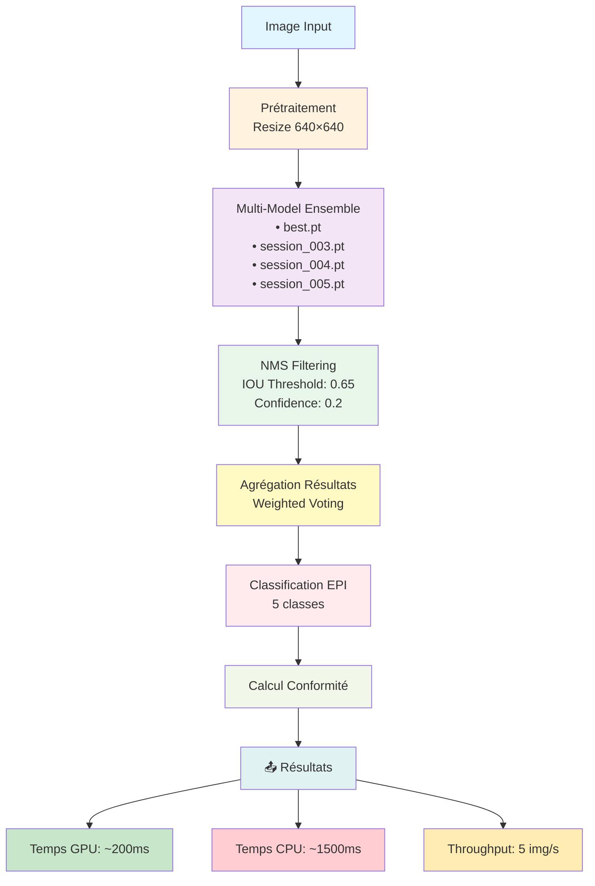

# 📐 Diagrammes d'Architecture du Projet EPI-DETECTION

## Table des Matières
1. [Diagramme de Paquetage (Package)](#1-diagramme-de-paquetage)
2. [Architecture Matérielle](#2-architecture-matérielle)
3. [Architecture Logicielle](#3-architecture-logicielle)
4. [Diagrammes Complémentaires](#4-diagrammes-complémentaires)

---

## 1. Diagramme de Paquetage

### 📦 Vue Générale des Modules



### 📋 Interprétation du Diagramme de Paquetage

**Couche Présentation (Bleu):**
- **Templates Web:** Fichiers HTML (unified_monitoring.html, arduino_control_panel.html)
- **Assets Statiques:** CSS, JavaScript, images stockés dans le dossier `static/`
- **Rôle:** Interface utilisateur pour visualiser les détections et contrôler Arduino

**Couche Application/Métier (Orange):**
- **Flask Backend:** Serveur web Python avec framework Flask
- **API Routes:** Points d'accès REST pour les opérations
- **Detection Engine:** Moteur de détection utilisant YOLOv5
- **Arduino Integration:** Module de communication avec Arduino
- **Model Manager:** Gestion des modèles de ML (chargement, versioning)
- **Database Manager:** Gestion des opérations de base de données
- **Rôle:** Traitement métier, orchestration des services

**Couche Données (Violet):**
- **Modèles YOLOv5:** Fichiers .pt (best.pt, session_003-005.pt)
- **Dataset EPI:** Images d'entraînement et validation
- **Base de Données:** SQLite ou MySQL pour stocker les détections
- **Cache/Logs:** Fichiers log et cache temporaire
- **Rôle:** Persistance et stockage des données

**Périphériques Physiques (Vert):**
- **Arduino TinkerCAD:** Microcontrôleur simulé
- **Composants:** Capteurs de température/humidité, motion
- **Actuateurs:** LEDs (vert/rouge) et buzzer d'alerte
- **Rôle:** Retour physique et collecte de données environnementales

---

## 2. Architecture Matérielle

### 🔌 Schéma Complet du Système Matériel



### 📋 Détails Techniques

**Capteurs (Entrées):**
- DHT22: Température/Humidité via Pin D4 (I2C), lecture toutes les 2 secondes
- PIR: Détecteur mouvement Pin D2, signal HIGH lors détection, portée 5-7m
- Webcam USB: Flux vidéo direct au PC Python (1280x720 MJPEG)

**Microcontrôleur Arduino:**
- CPU: ATmega328P 16MHz avec 2KB RAM et 32KB Flash
- GPIO: 14 pins numériques + 6 pins analogiques
- Communication: UART Série 9600 baud via USB (CH340 ou FT232)
- Alimentation: USB 5V, courant moyen 40mA

**Actuateurs (Sorties):**
- LED Verte (Pin D11): Indique conformité ≥80% (SAFE)
- LED Rouge (Pin D12): Indique conformité <80% (WARNING/DANGER)
- Buzzer Piezo (Pin D13): Alerte sonore 2-5kHz quand danger détecté

**Communication Série:**
- Protocole: UART/Serial 9600 baud 8N1 (8 bits, pas de parité, 1 stop)
- Câble: USB vers Mini-B (Arduino) - COM3 typiquement
- Flux: Arduino → Python (capteurs), Python → Arduino (commandes)

**Serveur PC:**
- Backend Flask Python sur port 5000
- Base de données SQLite ou MySQL
- Reçoit images webcam, envoie conformité (C85), stocke historique

### 🎯 Interprétation de l'Architecture Matérielle

**Couche de Capteurs:**
- **DHT22:** Collecte température/humidité toutes les 2 secondes
- **Capteur PIR:** Détecte mouvements dans la zone surveillée
- **Webcam:** Capture flux vidéo pour détection EPI
- Tous les capteurs envoient leurs données à Arduino en continu

**Microcontrôleur Arduino:**
- **Rôle central:** Collecte des capteurs et contrôle des actuateurs
- **Communication:** Via UART sériel au PC (9600 baud)
- **Traitement local:** Temps réel pour réactivité immédiate
- **Pin mapping:** Configuration GPIO pour chaque capteur/actuateur

**Actuateurs:**
- **LEDs:** Signalisation visuelle (vert=sûr, rouge=danger)
- **Buzzer:** Alerte sonore en cas de non-conformité EPI
- Réagissent aux commandes du backend Python

**Flux Bidirectionnel:**
- Arduino → Python: Données de capteurs
- Python → Arduino: Commandes conformité et contrôle

---

## 3. Architecture Logicielle

### 🏗️ Architecture Complète en Couches



### 📋 Couches et Responsabilités

**Tier 1 - Présentation (Interface Utilisateur):**
- **Dashboard Principal:** Affichage temps réel détections YOLOv5, historique
- **Panel Arduino:** Visualisation capteurs (temp/humidité/mouvement), contrôle LEDs/Buzzer
- **Navigateur:** HTTP/WebSocket pour communication asynchrone
- **Rôle:** Présenter données et recevoir commandes utilisateur

**Tier 2 - Application (Flask Backend):**
- **Main App:** Point d'entrée, initialisation Flask, enregistrement routes
- **API Routes:** Points d'accès REST (/api/detect, /api/arduino/*, /api/stats/*)
- **Logique Métier:** Orchestration entre services, validation données, gestion workflow
- **Rôle:** Recevoir requêtes frontend, coordonner services, retourner résultats

**Tier 3 - Services (Logique Métier Spécialisée):**
- **Detection Service:** YOLOv5 inference multi-modèles, NMS, calcul conformité EPI
- **Arduino Service:** Gestion connexion sérielle, parsing données capteurs, envoi commandes
- **Database Service:** Opérations CRUD via SQLAlchemy, transactions
- **Model Management:** Chargement/déchargement modèles, cache, versioning
- **Rôle:** Implémenter logique spécialisée pour chaque domaine

**Tier 4 - Infrastructure (Ressources Externes):**
- **Modèles ML:** Fichiers .pt pré-entraînés (best.pt, session_*.pt)
- **Base de Données:** SQLite ou MySQL, tables détections/capteurs/modèles
- **Système Fichiers:** Dataset images, logs, cache temporaire
- **Interface Matériel:** Accès serial port COM3 pour Arduino
- **Rôle:** Fournir ressources et persistance aux services

### 🔄 Flux d'Exécution: Détection d'EPI

```
1. User → Upload image
      ↓
2. Frontend → POST /api/detect (image binary)
      ↓
3. Flask → Réception & prétraitement
      ↓
4. Detection Service → YOLOv5 inference (4 modèles)
      ↓
5. NMS & Agrégation → Union/Weighted voting
      ↓
6. Classification → Helmet/Vest/Glasses/Boots/Person
      ↓
7. Calcul Conformité → Score % et état (SAFE/WARNING/DANGER)
      ↓
8. DB Service → Sauvegarde détections en BD
      ↓
9. Arduino Service → Envoi conformité à Arduino (C85)
      ↓
10. Arduino → Activation LED verte/rouge + Buzzer si danger
      ↓
11. Flask → Retour JSON (detections, confidence, conformity)
      ↓
12. Frontend → Affichage results, visualisation dashboard
      ↓
13. User → Voir résultats avec bounding boxes colorées
```

### 🎯 Interprétation de l'Architecture Logicielle

---

## 4. Diagrammes Complémentaires

### 🔄 Protocole de Communication Arduino-Python



### 📊 Classification et Conformité EPI



### 🔐 Sécurité et Persistance des Données



### ⚡ Performance et Optimisations



---

## 📝 Résumé Complet des Architectures

### 🔌 Architecture Matérielle - Points Clés
✅ **Capteurs:** DHT22 (temp/humidité), PIR (mouvement), Webcam USB  
✅ **Microcontrôleur:** Arduino UNO ATmega328P 16MHz  
✅ **Actuateurs:** LEDs (vert/rouge), Buzzer piezo  
✅ **Communication:** UART Série 9600 baud via USB COM3  
✅ **Flux:** Bidirectionnel capteurs → Arduino → PC, PC → Arduino → Actuateurs  

**Rôle:** Collecte de données environnementales et retour physique (visuel/sonore)

---

### 🏗️ Architecture Logicielle - Points Clés
✅ **Tier 1 - Présentation:** Dashboard web + Control Panel Arduino  
✅ **Tier 2 - Application:** Flask + Routes API REST  
✅ **Tier 3 - Services:** Detection (YOLOv5), Arduino (Serial), Database (SQLAlchemy), Model Manager  
✅ **Tier 4 - Infrastructure:** Modèles ML, Base de données, Fichiers, Hardware  
✅ **Flux:** User → Frontend → API → Services → Infrastructure → Response  

**Rôle:** Orchestration des détections, persistance et retour physique

---

### 📦 Diagramme de Paquetage - Points Clés
✅ **Couche Présentation:** Templates HTML, Assets CSS/JS  
✅ **Couche Application:** Flask, Routes, Logique Métier  
✅ **Couche Données:** Modèles YOLOv5, Dataset, BD, Logs  
✅ **Périphériques:** Arduino + Capteurs/Actuateurs  
✅ **Interdépendances:** Bien structurées par couches  

**Rôle:** Vue modulaire et organisée du système complet

---

### 🎯 Cas d'Usage Principaux

#### 1️⃣ **Détection d'EPI (Cas Nominal)**
```
Utilisateur Upload Image
        ↓
Flask reçoit POST /api/detect
        ↓
YOLOv5 détecte EPI (Helmet, Vest, Glasses)
        ↓
Calcul conformité (score %)
        ↓
Sauvegarde en BD
        ↓
Envoi conformité à Arduino (C85)
        ↓
Arduino active LEDs/Buzzer
        ↓
Frontend affiche résultats
        ↓
User voit bounding boxes colorées + score
```

#### 2️⃣ **Monitoring Arduino Temps Réel**
```
Arduino DHT22 lit temp/humidité
        ↓
Arduino PIR détecte mouvement
        ↓
Arduino envoie [SENSOR] temp=25.5,humidity=60
        ↓
Python reçoit via Serial
        ↓
Sauvegarde en BD
        ↓
Frontend met à jour dashboard
        ↓
User voit capteurs en temps réel
```

#### 3️⃣ **Alerte Conformité**
```
Score conformité < 60%
        ↓
Status: DANGER
        ↓
Python envoie C20 (20% conformité)
        ↓
Arduino active LED rouge
        ↓
Arduino active Buzzer 2kHz
        ↓
User entend alerte sonore
```

---

## 🔗 Relations entre Architectures

```
                    ┌─────────────────────────────────┐
                    │   Architecture Matérielle       │
                    │  (Capteurs → Arduino ↔ PC)     │
                    └──────────────┬──────────────────┘
                                   │ Serial Port COM3
                                   ↓
        ┌──────────────────────────────────────────────────────┐
        │       Architecture Logicielle (Tiers 1-4)            │
        │  ┌───────────────┐  ┌──────────────────────────┐    │
        │  │   Frontend    │  │  Détection YOLOv5 +      │    │
        │  │  Dashboard    │  │  Arduino Integration +    │    │
        │  │  Arduino Panel│  │  Database Management     │    │
        │  └───────────────┘  └──────────────────────────┘    │
        └──────────────────────────────────────────────────────┘
                                   ↓
        ┌──────────────────────────────────────────────────────┐
        │       Diagramme de Paquetage                         │
        │  (Organisation logique de tous les modules)          │
        │  • Présentation | Application | Données | Devices   │
        └──────────────────────────────────────────────────────┘
```

---

## 📊 Tableau Récapitulatif Complet

| Aspect | Détails |
|--------|---------|
| **Microcontrôleur** | Arduino UNO ATmega328P, 16MHz, 2KB RAM |
| **Capteurs** | DHT22 (I2C), PIR (GPIO D2), Webcam USB |
| **Actuateurs** | LED Verte (D11), LED Rouge (D12), Buzzer (D13) |
| **Communication** | UART 9600 baud 8N1 via USB COM3 |
| **Backend** | Python Flask port 5000 |
| **Modèles** | YOLOv5 best.pt + 3 sessions, GPU-enabled |
| **Base de Données** | SQLite par défaut, MySQL optionnel |
| **Frontend** | HTML5 Dashboard + Control Panel |
| **Classes EPI** | Helmet, Vest, Glasses, Boots, Person |
| **Conformité** | Score % : ≥80% SAFE, 60-79% WARNING, <60% DANGER |
| **Temps Inference** | ~200ms GPU / ~1500ms CPU par image |
| **Throughput** | 5 img/s GPU / 0.67 img/s CPU |

---
