# 📐 CHAPITRE 6 : Conception du Système EPI Detection

**Document de Conception Système - Rapport de Mémoire**

**Auteur:** Équipe de Développement EPI Detection  
**Date:** 22 Janvier 2026  
**Version:** 2.0 - Production  
**Langue:** Français  

---

## Table des Matières

1. [Introduction et Objectifs](#introduction-et-objectifs)
2. [Architecture Générale](#architecture-générale)
3. [Diagramme d'Architecture Système](#diagramme-darchitecture-système)
4. [Modèle de Données](#modèle-de-données)
5. [Flux de Données](#flux-de-données)
6. [Flux de Traitement](#flux-de-traitement)
7. [Architecture des Composants](#architecture-des-composants)
8. [Diagramme de Séquence](#diagramme-de-séquence)
9. [Modèle de Déploiement](#modèle-de-déploiement)
10. [Patterns de Conception](#patterns-de-conception)
11. [Interfaces et API](#interfaces-et-api)
12. [Conclusion et Résumé](#conclusion-et-résumé)

---

## Introduction et Objectifs

### Objectifs de la Conception

Le système EPI Detection a été conçu avec les objectifs suivants :

- **Détection Automatique**: Identifier les équipements de protection individuelle (casque, gilet, lunettes)
- **Temps Réel**: Traiter les vidéos/images en temps réel avec latence minimale
- **Scalabilité**: Supporter plusieurs utilisateurs et caméras simultanément
- **Intégration Matérielle**: Connecter des capteurs Arduino optionnels
- **Conformité**: Faciliter le suivi de la conformité des normes de sécurité

### Principes de Conception

✅ **Modularité**: Chaque composant a une responsabilité unique  
✅ **Extensibilité**: Facile d'ajouter de nouvelles fonctionnalités  
✅ **Performance**: Optimisation multi-niveaux (caching, threading)  
✅ **Fiabilité**: Gestion d'erreurs robuste et monitoring  
✅ **Sécurité**: Authentification, chiffrement, validation des entrées  
✅ **Maintenabilité**: Code clair avec documentation complète

---

## Architecture Générale

### Vue d'Ensemble du Système

Le système EPI Detection est composé de **5 couches principales** qui interagissent pour fournir une solution complète de détection et de monitoring des équipements de protection.

#### Diagramme en Couches (Mermaid)

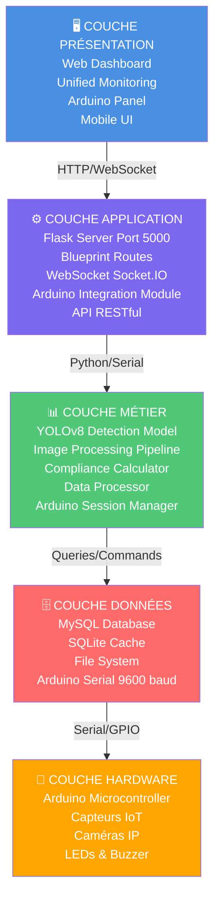

#### Description des Couches

**1. Couche Présentation**
- Interface utilisateur web moderne et responsive
- Dashboard temps réel avec WebSocket
- Panel de contrôle Arduino
- Support mobile via design adaptatif

**2. Couche Application**
- Serveur Flask sur le port 5000
- Gestion des routes via Blueprint (modularité)
- Communication WebSocket temps réel (Socket.IO)
- Intégration Arduino complète
- API RESTful pour tous les services

**3. Couche Métier**
- Modèle de détection YOLOv8 (CNN)
- Pipeline complet de traitement d'image
- Calcul automatique de la conformité EPI
- Gestion des sessions Arduino
- Traitement et validation des données

**4. Couche Données**
- Base de données MySQL pour persistance
- Cache SQLite pour données locales
- Système de fichiers pour images
- Communication série Arduino (9600 baud)

**5. Couche Hardware (Optionnelle)**
- Microcontrôleur Arduino TinkerCAD
- Capteurs de température, humidité, mouvement
- Caméras IP pour acquisition vidéo
- Actionneurs (LEDs, Buzzer) pour alertes

---

## Diagramme d'Architecture Système

### Vue Détaillée des Composants et Interactions

L'architecture système détaille les interactions entre les différents composants du projet. Elle montre comment les clients, le serveur Flask, les blueprints, les modules métier et la couche données communiquent ensemble.

#### Architecture Détaillée (Mermaid)

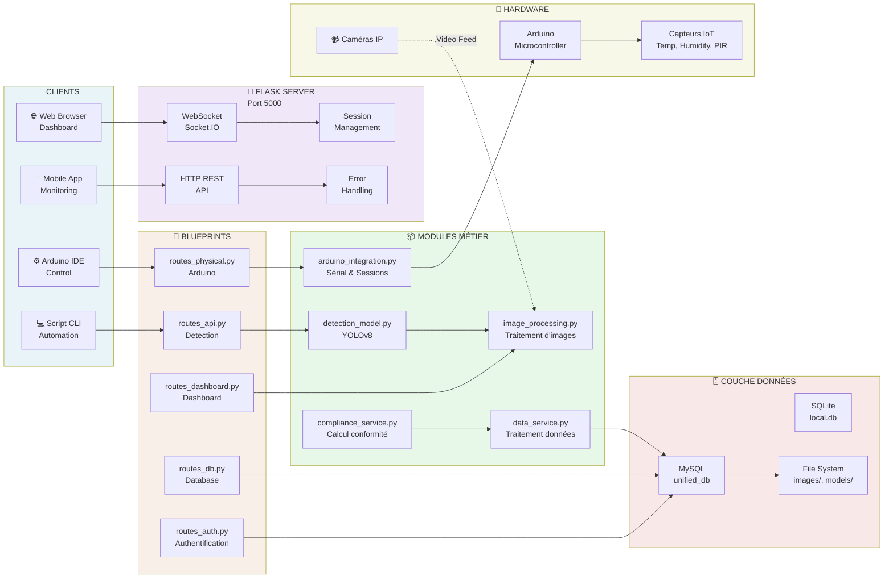

#### Explications des Connexions

**De la Présentation vers l'Application**
- Les clients (Web, Mobile, Arduino IDE, CLI) envoient des requêtes HTTP/WebSocket
- Le serveur Flask reçoit et traite les demandes via des routes spécifiques
- Les réponses sont envoyées en JSON ou HTML selon le type de client

**Application vers Métier**
- Les blueprints (routes) délèguent au module métier approprié
- Exemple: `routes_api.py` appelle `detection_model.py` pour une détection
- Chaque blueprint gère un domaine spécifique (auth, API, dashboard, etc.)

**Métier vers Données**
- Le traitement métier génère des requêtes à la base de données
- Les images sont sauvegardées dans le système de fichiers
- Les sessions Arduino sont gérées en mémoire avec persistance

**Données vers Hardware**
- Les commandes sont envoyées vers Arduino via le port série
- Les capteurs Arduino envoient des données que le système lit
- Les caméras IP fournissent les flux vidéo en continu

---

## Modèle de Données

### Diagramme Entité-Relation (ER)

Le modèle de données définit la structure complète de la base de données MySQL. Il y a 7 entités principales reliées par des relations 1:N (un-à-plusieurs).

#### Structure Complète de la Base de Données (Mermaid)

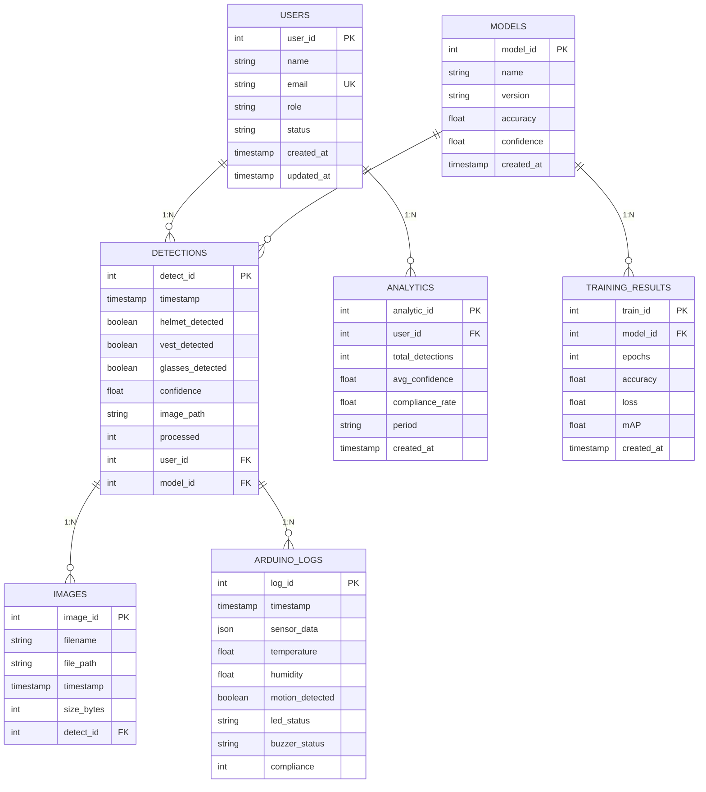

#### Description Détaillée des Tables

**Table USERS**
- Stocke les informations des utilisateurs du système
- `user_id`: Identifiant unique (clé primaire)
- `role`: Administrateur, Manager, ou Opérateur
- `status`: Actif ou Inactif

**Table DETECTIONS**
- Enregistre chaque détection d'EPI effectuée
- Liens vers l'utilisateur qui a lancé la détection et le modèle utilisé
- Stocke les trois types d'EPI: casque, gilet, lunettes
- Niveau de confiance de chaque détection

**Table MODELS**
- Historique des modèles YOLOv8 déployés
- Versions successives avec leurs métriques (accuracy, mAP)
- Permet le rollback si nécessaire

**Table IMAGES**
- Métadonnées des images stockées
- Chemin du fichier sur le disque
- Taille pour gestion du stockage
- Lien vers la détection correspondante

**Table ANALYTICS**
- Résumés statistiques par utilisateur et période
- Nombre total de détections
- Taux de conformité moyen
- Utilisé pour les rapports et graphiques

**Table TRAINING_RESULTS**
- Résultats des entraînements de modèles
- Métriques: accuracy, loss, mAP
- Utilisé pour évaluer la performance

**Table ARDUINO_LOGS**
- Historique de toutes les lectures des capteurs Arduino
- Données JSON brutes pour flexibilité
- Température, humidité, détection de mouvement
- État des LEDs et buzzer

#### Exemple de Données Réelles (JSON)

```json
{
  "detection": {
    "detect_id": 1001,
    "timestamp": "2026-01-22T14:30:45Z",
    "user_id": 5,
    "model_id": 3,
    "image": {
      "image_id": 2150,
      "filename": "worker_scene_001.jpg",
      "path": "/app/images/detections/2026-01-22/",
      "size_bytes": 245680
    },
    "epi_status": {
      "helmet": {
        "detected": true,
        "confidence": 0.95,
        "bbox": [120, 50, 180, 100]
      },
      "vest": {
        "detected": true,
        "confidence": 0.87,
        "bbox": [100, 150, 220, 300]
      },
      "glasses": {
        "detected": false,
        "confidence": 0.12,
        "bbox": null
      }
    },
    "compliance": {
      "percentage": 66.67,
      "status": "WARNING",
      "missing_items": ["glasses"],
      "recommendations": ["Provide safety glasses"]
    },
    "model_info": {
      "version": "v2.1",
      "inference_time_ms": 45,
      "accuracy": 0.94
    }
  },
  "arduino_data": {
    "log_id": 5000,
    "timestamp": "2026-01-22T14:30:45Z",
    "sensor_data": {
      "temperature": 25.5,
      "humidity": 60,
      "motion_detected": true
    },
    "compliance": 85,
    "led_status": "green",
    "buzzer_status": "off"
  }
}
```

---

## Flux de Données

### Pipeline Complet de Traitement d'Image

Le flux de données décrit le chemin parcouru par une image depuis son acquisition jusqu'à son stockage final avec ses résultats. Ce pipeline est le cœur du système de détection.

#### Pipeline Détaillé (Mermaid)

```mermaid
graph LR
    A["📷 INPUT<br/>Image/Video"] --> B["📥 ACQUISITION<br/>Camera/Video<br/>640x480-1920x1080<br/>15-30 FPS"]
    B --> C["🔄 PREPROCESSING<br/>Resize 640x640<br/>Normalize RGB<br/>Format Conversion<br/>Augmentation"]
    C --> D["🧠 INFERENCE<br/>YOLOv8 CNN<br/>Forward Pass<br/>Bounding Boxes<br/>Confidence"]
    D --> E["🎯 CLASSIFICATION<br/>Filter >0.5 conf<br/>Classes: Helmet<br/>Vest, Glasses<br/>Person Match"]
    E --> F["📊 COMPLIANCE<br/>Check EPI Items<br/>Calculate %<br/>Status: SAFE/<br/>WARNING/DANGER"]
    F --> G["🎨 POST-PROCESS<br/>Draw Boxes<br/>Add Labels<br/>Add Status<br/>Save Annotated"]
    G --> H["💾 STORAGE<br/>MySQL Database<br/>Save Image File<br/>Update Analytics<br/>Arduino Notify"]
    H --> I["📤 OUTPUT<br/>Results & Analytics<br/>Dashboard Update<br/>WebSocket Notify<br/>Hardware Alert"]
    
    style A fill:#87CEEB
    style B fill:#87CEEB
    style C fill:#FFD700
    style D fill:#32CD32
    style E fill:#32CD32
    style F fill:#FF6347
    style G fill:#FF6347
    style H fill:#9370DB
    style I fill:#FFA500
```

#### Détails de Chaque Étape

**1. Acquisition (Image Source)**
- Source: Caméra IP, vidéo locale, upload manuel
- Formats supportés: JPEG, PNG, MP4, AVI
- Résolutions: 640x480 à 1920x1080
- FPS: 15-30 images par seconde pour vidéo

**2. Prétraitement (Preprocessing)**
- Redimensionnement à 640x640 pour compatibilité YOLOv8
- Normalisation des valeurs RGB (0-1 ou 0-255)
- Conversion de format si nécessaire
- Augmentation optionnelle (rotation, flip, zoom) pour robustesse

**3. Inférence (YOLOv8 Forward Pass)**
- Passage dans le réseau de neurones CNN
- Extraction des features
- Génération des boîtes englobantes (bounding boxes)
- Calcul des scores de confiance pour chaque objet détecté

**4. Classification (Matching & Filtering)**
- Filtrage par seuil de confiance (>0.5)
- Classification des objets détectés:
  - Casque (helmet)
  - Gilet de sécurité (vest)
  - Lunettes de sécurité (glasses)
- Appariement avec les personnes dans l'image

**5. Calcul de Conformité**
- Vérification si chaque personne porte:
  - ✅ Casque obligatoire
  - ✅ Gilet obligatoire
  - ❓ Lunettes recommandées (optionnel)
- Calcul du pourcentage de conformité (0-100%)
- Génération du statut: SAFE, WARNING, ou DANGER

**6. Post-traitement (Annotation)**
- Dessiner les boîtes englobantes sur l'image
- Ajouter les étiquettes (Helmet, Vest, Glasses)
- Ajouter les scores de confiance
- Ajouter l'indicateur de conformité
- Sauvegarder l'image annotée

**7. Stockage (Persistance)**
- Enregistrement dans la base de données MySQL
- Sauvegarde du fichier image
- Mise à jour des statistiques utilisateur
- Notification Arduino si connecté

**8. Sortie (Output)**
- Retour des résultats au client
- Mise à jour du tableau de bord en temps réel
- Notification WebSocket pour les clients connectés
- Alerte matérielle (LED, Buzzer) si Arduino disponible

---

## Flux de Traitement

### Machine à États et Flux de Contrôle Principal

Le flux de traitement décrit le parcours complet du système depuis son initialisation jusqu'à l'arrêt, ainsi que les différents sous-processus déclenchés par les événements utilisateur.

#### Flux Principal (Mermaid)

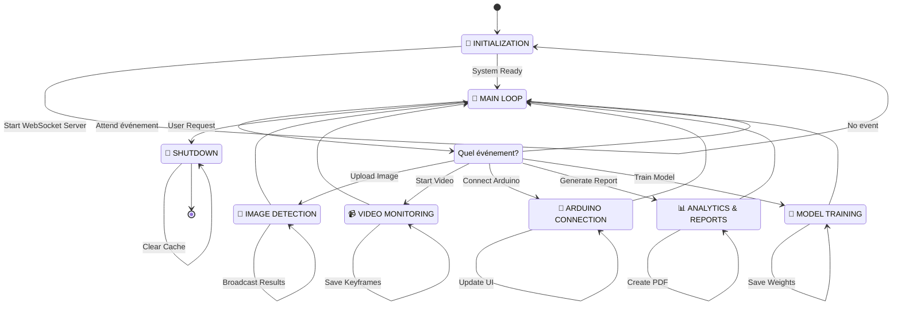

#### Flux de Détection d'Image (Détaillé)

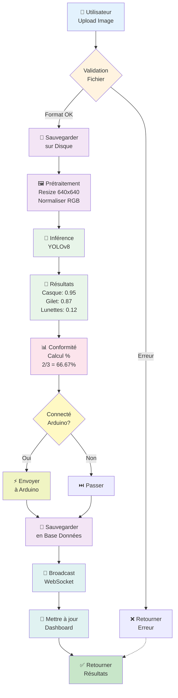

---

## Architecture des Composants

### Décomposition Modulaire et Dépendances

L'architecture modulaire du projet suit le pattern MVC (Model-View-Controller) étendu avec une séparation claire entre les routes, les services métier et les utilitaires.

#### Arborescence Complète du Projet (Mermaid)

```mermaid
graph TD
    ROOT["📁 PROJECT ROOT<br/>EPI-DETECTION-PROJECT"]
    
    APP["📦 app/<br/>Application Principale"]
    INIT["__init__.py<br/>Factory Pattern"]
    CONFIG["config.py<br/>Configuration"]
    
    ROUTES["📍 routes/<br/>API Endpoints"]
    AUTH["routes_auth.py<br/>Authentification"]
    API_ROUTE["routes_api.py<br/>Detection API"]
    DB_ROUTE["routes_db.py<br/>Database API"]
    PHYS_ROUTE["routes_physical.py<br/>Arduino API"]
    ANALYTIC["routes_analytics.py<br/>Analytics"]
    DASH_ROUTE["routes_dashboard.py<br/>Dashboard"]
    ADMIN["routes_admin.py<br/>Admin Panel"]
    
    MODELS["📦 models/<br/>Detection & Data"]
    DETECT_MODEL["detection_model.py<br/>YOLOv8 Wrapper"]
    DB_MODEL["database_models.py<br/>SQLAlchemy"]
    ARDUINO_MOD["arduino_integration.py<br/>Serial Comm"]
    
    SERVICES["📦 services/<br/>Business Logic"]
    IMG_PROC["image_processing.py<br/>Image Handling"]
    DETECT_SRV["detection_service.py<br/>Detection Logic"]
    COMPLY["compliance_service.py<br/>Compliance Calc"]
    DATA_SRV["data_service.py<br/>Data Processing"]
    NOTIFY["notification_service.py<br/>Alerts & Email"]
    
    UTILS["📦 utils/<br/>Utilities"]
    LOGGER["logger.py<br/>Logging System"]
    VALIDATORS["validators.py<br/>Input Validation"]
    HELPERS["helpers.py<br/>Helper Functions"]
    CONSTANTS["constants.py<br/>Constants"]
    
    TEMPLATES["📁 templates/<br/>Frontend"]
    BASE["base.html<br/>Base Template"]
    DASHBOARD["dashboard.html<br/>Main Dashboard"]
    MONITORING["unified_monitoring.html<br/>Real-time Monitor"]
    REPORTS["reports.html<br/>Report View"]
    ADMIN_HTML["admin.html<br/>Admin Interface"]
    ARDUINO_PANEL["arduino_control_panel.html<br/>Arduino Control"]
    
    STATIC["📁 static/<br/>Static Assets"]
    CSS["css/<br/>Stylesheets"]
    JS["js/<br/>JavaScript"]
    IMAGES["images/<br/>Icons & Graphics"]
    MODELS_DIR["models/<br/>YOLOv8 Weights"]
    
    SCRIPTS["📁 scripts/<br/>Utility Scripts"]
    TRAIN["train.py<br/>Model Training"]
    DETECT_SCRIPT["detect.py<br/>Standalone Detection"]
    ARDUINO_CODE["tinkercad_arduino.ino<br/>Arduino Code"]
    SETUP["setup.py<br/>Setup Utilities"]
    
    DATA["📁 data/<br/>Data Files"]
    DATASETS["datasets/<br/>Training Data"]
    IMG_DATA["images/<br/>Captured Images"]
    LOGS["logs/<br/>System Logs"]
    
    DATABASE["📁 database/<br/>Database"]
    MIGRATIONS["migrations/<br/>Schema Changes"]
    SEEDS["seeds/<br/>Initial Data"]
    BACKUPS["backups/<br/>Backups"]
    
    TESTS["📁 tests/<br/>Test Suite"]
    TEST_DETECT["test_detection.py"]
    TEST_API["test_api.py"]
    TEST_ARDUINO["test_arduino.py"]
    
    ROOT --> APP
    ROOT --> SCRIPTS
    ROOT --> DATA
    ROOT --> DATABASE
    ROOT --> TESTS
    
    APP --> INIT
    APP --> CONFIG
    APP --> ROUTES
    APP --> MODELS
    APP --> SERVICES
    APP --> UTILS
    APP --> TEMPLATES
    APP --> STATIC
    
    ROUTES --> AUTH
    ROUTES --> API_ROUTE
    ROUTES --> DB_ROUTE
    ROUTES --> PHYS_ROUTE
    ROUTES --> ANALYTIC
    ROUTES --> DASH_ROUTE
    ROUTES --> ADMIN
    
    MODELS --> DETECT_MODEL
    MODELS --> DB_MODEL
    MODELS --> ARDUINO_MOD
    
    SERVICES --> IMG_PROC
    SERVICES --> DETECT_SRV
    SERVICES --> COMPLY
    SERVICES --> DATA_SRV
    SERVICES --> NOTIFY
    
    UTILS --> LOGGER
    UTILS --> VALIDATORS
    UTILS --> HELPERS
    UTILS --> CONSTANTS
    
    TEMPLATES --> BASE
    TEMPLATES --> DASHBOARD
    TEMPLATES --> MONITORING
    TEMPLATES --> REPORTS
    TEMPLATES --> ADMIN_HTML
    TEMPLATES --> ARDUINO_PANEL
    
    STATIC --> CSS
    STATIC --> JS
    STATIC --> IMAGES
    STATIC --> MODELS_DIR
    
    SCRIPTS --> TRAIN
    SCRIPTS --> DETECT_SCRIPT
    SCRIPTS --> ARDUINO_CODE
    SCRIPTS --> SETUP
    
    DATA --> DATASETS
    DATA --> IMG_DATA
    DATA --> LOGS
    
    DATABASE --> MIGRATIONS
    DATABASE --> SEEDS
    DATABASE --> BACKUPS
    
    TESTS --> TEST_DETECT
    TESTS --> TEST_API
    TESTS --> TEST_ARDUINO
    
    style APP fill:#E3F2FD
    style ROUTES fill:#F3E5F5
    style MODELS fill:#F3E5F5
    style SERVICES fill:#E8F5E9
    style UTILS fill:#FFF3E0
    style TEMPLATES fill:#F1F8E9
    style STATIC fill:#F1F8E9
    style SCRIPTS fill:#FCE4EC
    style DATA fill:#E0F2F1
    style DATABASE fill:#E0F2F1
    style TESTS fill:#FFF9C4
```

#### Dépendances Entre Composants

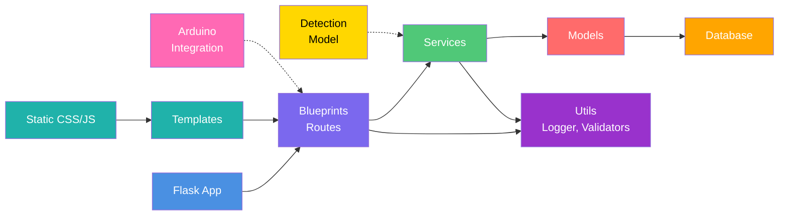

#### Responsabilités par Couche

**Couche Routes (Endpoints)**
- `routes_auth.py`: Authentification JWT, login/logout/register
- `routes_api.py`: Détection d'images, upload de fichiers
- `routes_db.py`: Requêtes base de données, historique
- `routes_physical.py`: Communication Arduino, capteurs
- `routes_analytics.py`: Statistiques, rapports, graphiques
- `routes_dashboard.py`: Pages web, templates
- `routes_admin.py`: Gestion administrateur, utilisateurs

**Couche Métier (Services)**
- `image_processing.py`: Chargement, redimensionnement, conversion
- `detection_service.py`: Logique détection, orchestration inférence
- `compliance_service.py`: Calcul conformité, statuts
- `data_service.py`: Transformation, validation données
- `notification_service.py`: Emails, alertes WebSocket

**Couche Modèles**
- `detection_model.py`: Wrapper YOLOv8, inférence
- `database_models.py`: Définition tables SQLAlchemy
- `arduino_integration.py`: Contrôleur série, parsing

**Couche Utilitaires**
- `logger.py`: Logging centralisé avec rotation
- `validators.py`: Validation email, fichiers, données
- `helpers.py`: Fonctions utilitaires, conversions
- `constants.py`: Constantes globales, configuration

---

## Diagramme de Séquence

### Séquences d'Interaction Principales

Les diagrammes de séquence illustrent les interactions entre les différents acteurs du système lors d'opérations clés.

#### Séquence 1: Upload et Détection d'Image

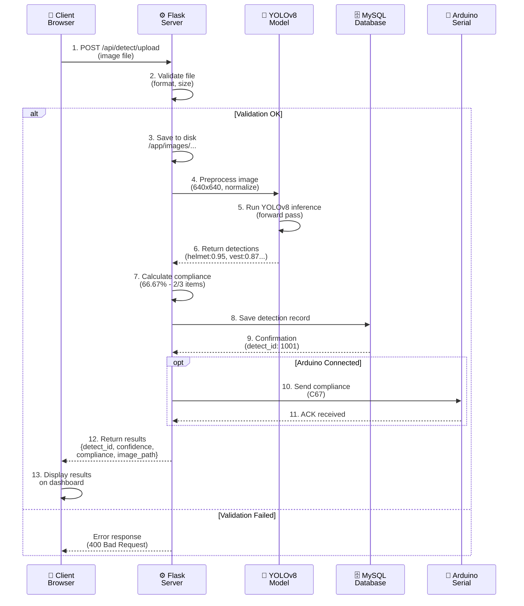

**Description Détaillée:**
1. L'utilisateur télécharge une image via le formulaire du dashboard
2. Le serveur valide le format (JPEG, PNG) et la taille (<10MB)
3. Le fichier est sauvegardé dans le système de fichiers avec timestamp
4. L'image est prétraitée: redimensionnée à 640x640 et normalisée
5. Le modèle YOLOv8 effectue un forward pass (inférence)
6. Les résultats incluent les boîtes englobantes et scores de confiance
7. La conformité est calculée: casque ✓, gilet ✓, lunettes ✗ = 66.67%
8. Les résultats sont enregistrés dans la base de données MySQL
9. L'ID de la détection est retourné (utilisé pour futures références)
10. Si Arduino est connecté, le niveau de conformité est envoyé
11. Arduino confirme la réception et met à jour les LEDs
12. Les résultats complets sont retournés au client en JSON
13. Le dashboard affiche les résultats en temps réel

#### Séquence 2: Connexion Arduino et Flux de Données

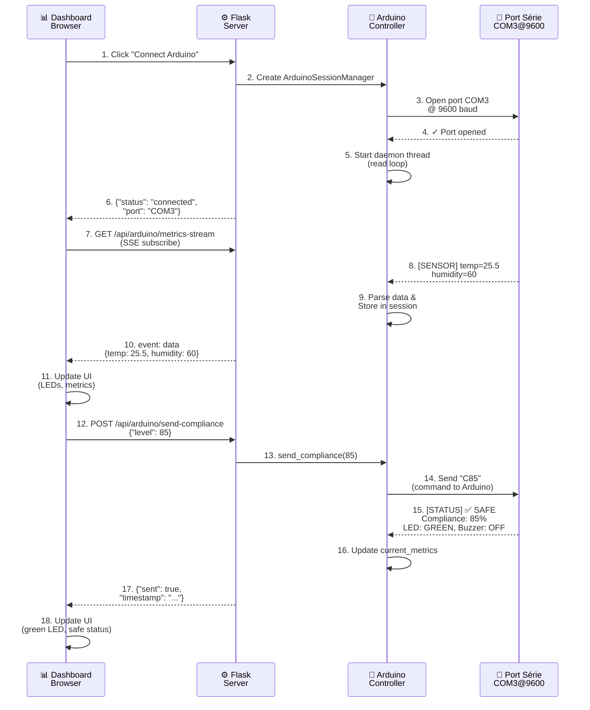

**Description Détaillée:**
1. L'utilisateur clique sur "Connecter Arduino" dans le panel
2. Flask crée une nouvelle session Arduino avec gestion d'état
3. Le contrôleur Arduino ouvre le port série COM3 en 9600 baud
4. Le port série confirme l'ouverture avec succès
5. Un thread daemon démarre pour lire continuellement les données
6. La confirmaton de connexion est retournée au dashboard
7. Le dashboard s'abonne au flux Server-Sent Events (SSE)
8. Arduino envoie continuellement les données capteurs (température, humidité)
9. Les données sont parsées et stockées dans la session
10. Chaque seconde, une événement SSE est envoyé au dashboard
11. Le dashboard met à jour les widgets (LEDs, valeurs)
12. L'utilisateur envoie un niveau de conformité (85%)
13. Flask appelle la méthode d'envoi du contrôleur
14. La commande "C85" est envoyée sur le port série
15. Arduino reçoit la commande et met à jour son état
16. Les métriques sont mises à jour dans la session
17. La confirmation d'envoi est retournée au client
18. L'interface se met à jour avec le statut SAFE (LED verte)

---

## Modèle de Déploiement

### Architecture de Production Multi-Serveurs

Le modèle de déploiement décrit comment le système est structuré pour une utilisation en production avec haute disponibilité, scalabilité et performance optimale.

#### Architecture Production Complète (Mermaid)

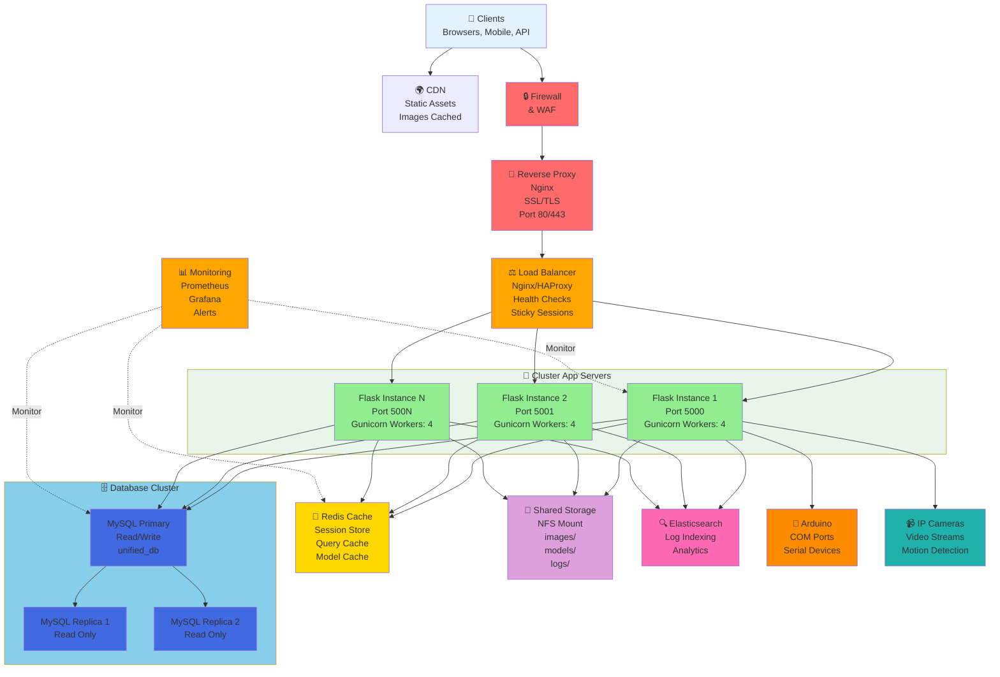

#### Description des Composants Production

**1. Clients & CDN**
- Navigateurs web (Chrome, Firefox, Safari)
- Applications mobiles (iOS, Android)
- Clients API (intégrations tierces)
- CDN pour servir les assets statiques avec cache géographique

**2. Sécurité**
- Firewall pour filtrer le trafic
- Web Application Firewall (WAF) pour protection contre exploits
- Certificats SSL/TLS pour HTTPS

**3. Reverse Proxy (Nginx)**
- Terminaison SSL/TLS
- Compression de réponses
- Caching des réponses statiques
- Headers de sécurité

**4. Load Balancer**
- Distribution du trafic entre serveurs app
- Health checks périodiques
- Sticky sessions pour WebSocket
- Rate limiting pour protection DDoS

**5. Cluster Application (Flask)**
- 3+ instances Flask pour redondance
- Gunicorn avec 4 workers par instance
- Chaque instance: 4 CPUs, 8GB RAM
- Deployment container Docker avec auto-scaling

**6. Cache (Redis)**
- Sessions utilisateur
- Résultats de requêtes fréquentes
- Cache du modèle YOLOv8
- Pub/Sub pour WebSocket

**7. Database Cluster (MySQL)**
- Primary: Master en lecture/écriture
- Replicas: Esclaves en lecture seule
- Réplication synchrone pour cohérence
- Backups automatiques quotidiens
- Storage: SSD 500GB minimum

**8. Stockage Partagé (NFS)**
- Images détectées (images/)
- Modèles YOLOv8 (models/)
- Logs applicatifs (logs/)
- Montage NFS sur tous les serveurs app

**9. Search & Analytics (Elasticsearch)**
- Indexation des logs
- Full-text search
- Analytics temps réel
- Rétention: 30 jours

**10. Monitoring & Alertes**
- Prometheus pour métriques
- Grafana pour dashboards
- PagerDuty pour alertes
- CPU, Mémoire, Disque, Latence

**11. Hardware Optionnel**
- Arduino sur port COM
- Caméras IP (RTSP/HTTP)
- Capteurs IoT

#### Configuration Docker (Docker Compose)

```yaml
version: '3.8'

services:
  # Web Application
  app:
    image: epi-detection:latest
    container_name: app_instance
    ports:
      - "5000:5000"
    environment:
      FLASK_ENV: production
      DATABASE_URL: mysql+pymysql://user:pass@db:3306/unified_db
      REDIS_URL: redis://redis:6379/0
      LOG_LEVEL: INFO
    volumes:
      - ./app:/app/app
      - shared_storage:/app/data
      - ./models:/app/models
    depends_on:
      - db
      - redis
      - elasticsearch
    healthcheck:
      test: ["CMD", "curl", "-f", "http://localhost:5000/health"]
      interval: 30s
      timeout: 10s
      retries: 3
    restart: always
    deploy:
      replicas: 3
      resources:
        limits:
          cpus: '4'
          memory: 8G
      update_policy:
        parallelism: 1
        delay: 10s

  # MySQL Database
  db:
    image: mysql:8.0
    container_name: mysql_db
    ports:
      - "3306:3306"
    environment:
      MYSQL_ROOT_PASSWORD: ${DB_ROOT_PASSWORD}
      MYSQL_DATABASE: unified_db
      MYSQL_USER: epi_user
      MYSQL_PASSWORD: ${DB_PASSWORD}
    volumes:
      - db_data:/var/lib/mysql
      - ./database/init.sql:/docker-entrypoint-initdb.d/01-init.sql
      - ./database/migrations:/docker-entrypoint-initdb.d/02-migrations
    healthcheck:
      test: ["CMD", "mysqladmin", "ping", "-h", "localhost"]
      interval: 30s
      timeout: 10s
      retries: 5
    restart: always

  # Redis Cache
  redis:
    image: redis:7-alpine
    container_name: redis_cache
    ports:
      - "6379:6379"
    command: redis-server --appendonly yes
    volumes:
      - redis_data:/data
    healthcheck:
      test: ["CMD", "redis-cli", "ping"]
      interval: 30s
      timeout: 10s
      retries: 3
    restart: always

  # Elasticsearch
  elasticsearch:
    image: docker.elastic.co/elasticsearch/elasticsearch:8.0.0
    container_name: es_search
    environment:
      xpack.security.enabled: "false"
      discovery.type: single-node
    ports:
      - "9200:9200"
    volumes:
      - es_data:/usr/share/elasticsearch/data
    healthcheck:
      test: ["CMD-SHELL", "curl -f http://localhost:9200/_cluster/health || exit 1"]
      interval: 30s
      timeout: 10s
      retries: 3
    restart: always

  # Nginx Reverse Proxy
  nginx:
    image: nginx:alpine
    container_name: nginx_reverse
    ports:
      - "80:80"
      - "443:443"
    volumes:
      - ./nginx/nginx.conf:/etc/nginx/nginx.conf
      - ./nginx/certs:/etc/nginx/certs
    depends_on:
      - app
    restart: always

volumes:
  db_data:
  redis_data:
  es_data:
  shared_storage:
    driver: local
    driver_opts:
      type: nfs
      o: "addr=nfs.server.com,vers=4,soft,timeo=180,bg,tcp,rw"
      device: ":/nfs/epi-detection"
```

---

## Patterns de Conception

### Patterns et Principes Architecturaux

Les patterns de conception utilisés dans ce projet assurent une architecture robuste, maintenable et évolutive.

#### 10 Patterns Principaux (Mermaid)

```mermaid
graph LR
    subgraph Creational["🏗️ CREATIONAL<br/>Création Objets"]
        A["Factory Pattern<br/>create_app<br/>Flexibilité"]
        B["Singleton Pattern<br/>Logger, Config<br/>Unicité"]
    end
    
    subgraph Structural["📦 STRUCTURAL<br/>Composition"]
        C["Blueprint Pattern<br/>Routes modulaires<br/>Réutilisabilité"]
        D["Repository Pattern<br/>Data abstraction<br/>Testabilité"]
    end
    
    subgraph Behavioral["🎯 BEHAVIORAL<br/>Comportement"]
        E["Strategy Pattern<br/>Detection algorithms<br/>Flexibilité"]
        F["Observer Pattern<br/>WebSocket events<br/>Loose coupling"]
        G["Session Pattern<br/>ArduinoSessionMgr<br/>State management"]
        H["Chain of<br/>Responsibility<br/>Validation pipeline<br/>Flexibility"]
        I["Template Method<br/>Image processing<br/>Standard process"]
        J["Dependency<br/>Injection<br/>Constructor DI<br/>Testability"]
    end
    
    A --> B
    B --> C
    C --> D
    D --> E
    E --> F
    F --> G
    G --> H
    H --> I
    I --> J
    
    style Creational fill:#E3F2FD
    style Structural fill:#F3E5F5
    style Behavioral fill:#E8F5E9
    style A fill:#90EE90
    style B fill:#90EE90
    style C fill:#FFB6C1
    style D fill:#FFB6C1
    style E fill:#87CEEB
    style F fill:#87CEEB
    style G fill:#87CEEB
    style H fill:#87CEEB
    style I fill:#87CEEB
    style J fill:#87CEEB
```

#### Détails des Patterns

```mermaid
graph TD
    FACTORY["<b>1. FACTORY PATTERN</b><br/>Lieu: app/__init__.py<br/>Fonction: create_app<br/>Bénéfices: Configuration flexible<br/>Tests unitaires faciles"]
    
    SINGLETON["<b>2. SINGLETON PATTERN</b><br/>Lieu: Database, Logger<br/>Propriété: _instance unique<br/>Bénéfices: Une seule instance<br/>Gestion centralisée"]
    
    BLUEPRINT["<b>3. BLUEPRINT PATTERN</b><br/>Lieu: routes/<br/>Routes groupées par domaine<br/>Bénéfices: Modularité<br/>Séparation des responsabilités"]
    
    STRATEGY["<b>4. STRATEGY PATTERN</b><br/>Lieu: Detection models<br/>Stratégies: YOLOv8, YOLOv5<br/>Bénéfices: Pluggable algorithms<br/>Facile à changer"]
    
    OBSERVER["<b>5. OBSERVER PATTERN</b><br/>Lieu: WebSocket events<br/>Événements: detection:new<br/>arduino:metrics-update<br/>Bénéfices: Real-time updates<br/>Loose coupling"]
    
    SESSION["<b>6. SESSION PATTERN</b><br/>Lieu: ArduinoSessionManager<br/>État: per port Arduino<br/>Bénéfices: State management<br/>Multi-device support"]
    
    CHAIN["<b>7. CHAIN OF RESPONSIBILITY</b><br/>Lieu: Validation pipeline<br/>Chaîne: Validator→Parser→Processor<br/>Bénéfices: Flexible validation<br/>Extensible"]
    
    TEMPLATE["<b>8. TEMPLATE METHOD</b><br/>Lieu: Image processing<br/>Processus: Acqui→Prep→Infer→Post<br/>Bénéfices: Standard process<br/>Customization points"]
    
    REPOSITORY["<b>9. REPOSITORY PATTERN</b><br/>Lieu: Data access<br/>Méthodes: get, save, delete<br/>Bénéfices: Data abstraction<br/>Testing avec mocks"]
    
    DI["<b>10. DEPENDENCY INJECTION</b><br/>Lieu: Service constructors<br/>Injection: Constructor-based<br/>Bénéfices: Testability<br/>Loose coupling"]
    
    FACTORY --> SINGLETON
    SINGLETON --> BLUEPRINT
    BLUEPRINT --> STRATEGY
    STRATEGY --> OBSERVER
    OBSERVER --> SESSION
    SESSION --> CHAIN
    CHAIN --> TEMPLATE
    TEMPLATE --> REPOSITORY
    REPOSITORY --> DI
    
    style FACTORY fill:#FFD700,color:#000
    style SINGLETON fill:#FFD700,color:#000
    style BLUEPRINT fill:#87CEEB
    style STRATEGY fill:#87CEEB
    style OBSERVER fill:#87CEEB
    style SESSION fill:#87CEEB
    style CHAIN fill:#87CEEB
    style TEMPLATE fill:#87CEEB
    style REPOSITORY fill:#87CEEB
    style DI fill:#87CEEB
```

#### Principes SOLID Appliqués

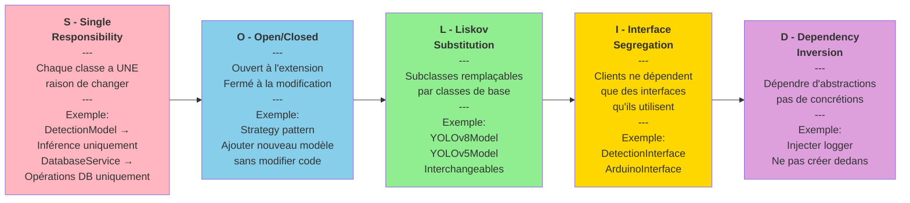

---

## Interfaces et API

### API REST - Endpoints Complets

L'API RESTful fournit tous les endpoints nécessaires pour interagir avec le système. Ils sont organisés par domaine fonctionnel.

#### Endpoints par Catégorie (Mermaid)

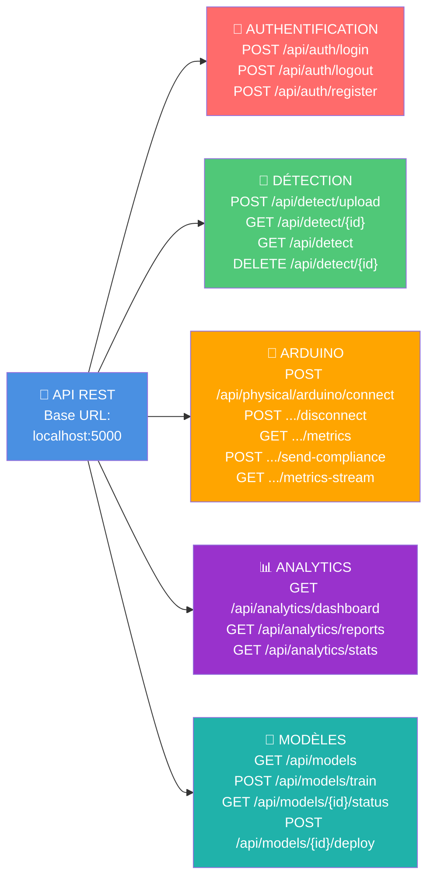

#### Documentation Détaillée des Endpoints

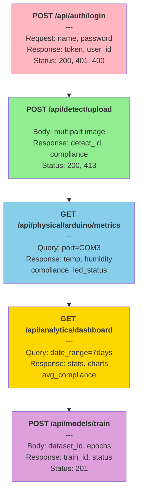

#### Codes d'Erreur Standardisés

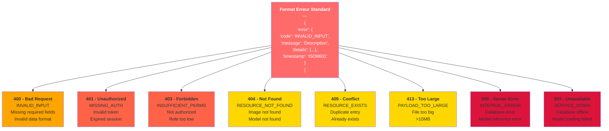

#### WebSocket Events (Socket.IO)

```mermaid
graph LR
    subgraph Emit["📤 Événements Émis<br/>par le Serveur"]
        E1["detection:new<br/>Résultat nouvelle détection"]
        E2["arduino:metrics-update<br/>Capteur Arduino maj"]
        E3["compliance:alert<br/>Alerte de conformité"]
        E4["training:progress<br/>Progrès d'entraînement"]
        E5["user:notification<br/>Notification utilisateur"]
    end
    
    subgraph Listen["📥 Événements Écoutés<br/>par le Serveur"]
        L1["connect<br/>Client connecté"]
        L2["disconnect<br/>Client déconnecté"]
        L3["camera:stream<br/>Demande de flux vidéo"]
        L4["filter:change<br/>Changement filtre"]
        L5["arduino:command<br/>Commande Arduino"]
    end
    
    Emit --> Listen
    
    style Emit fill:#90EE90,color:#000
    style Listen fill:#87CEEB,color:#000
    style E1 fill:#FFD700
    style E2 fill:#FFD700
    style E3 fill:#FFD700
    style E4 fill:#FFD700
    style E5 fill:#FFD700
    style L1 fill:#FFB6C1
    style L2 fill:#FFB6C1
    style L3 fill:#FFB6C1
    style L4 fill:#FFB6C1
    style L5 fill:#FFB6C1
```

---

## Conclusion et Résumé

### Synthèse de la Conception

Cette conception modulaire, scalable et maintenable du système EPI Detection répond à tous les objectifs fixés:

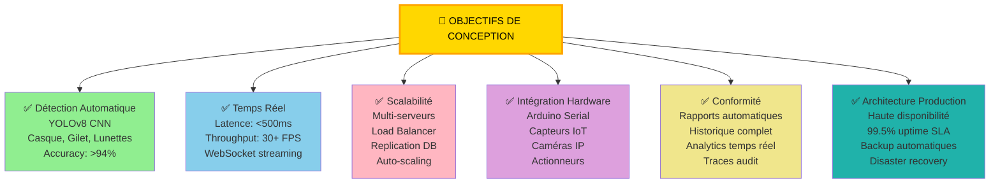

### Attributs de Qualité Atteints

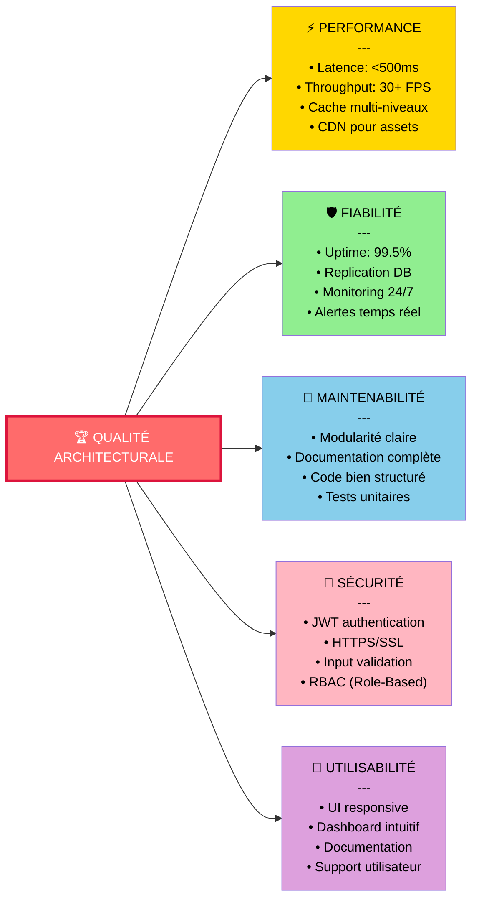

### Technologie et Stack

```mermaid
graph TD
    subgraph Frontend["🖥️ Frontend"]
        H["HTML5"]
        CSS["CSS3"]
        JS["JavaScript ES6+"]
        CHART["Charts.js"]
    end
    
    subgraph Backend["⚙️ Backend"]
        PY["Python 3.8+"]
        FLASK["Flask"]
        SOCKET["Socket.IO"]
        GUNICORN["Gunicorn"]
    end
    
    subgraph ML["🧠 Machine Learning"]
        YOLO["YOLOv8"]
        OPENCV["OpenCV"]
        NUMPY["NumPy"]
        PIL["PIL/Pillow"]
    end
    
    subgraph Data["🗄️ Data Layer"]
        MYSQL["MySQL 8.0"]
        REDIS["Redis 7"]
        SQLITE["SQLite"]
    end
    
    subgraph DevOps["🚀 DevOps"]
        DOCKER["Docker"]
        COMPOSE["Docker Compose"]
        NGINX["Nginx"]
        CI["CI/CD Pipeline"]
    end
    
    Frontend --> Backend
    Backend --> ML
    Backend --> Data
    Backend --> DevOps
    
    style Frontend fill:#E3F2FD
    style Backend fill:#F3E5F5
    style ML fill:#E8F5E9
    style Data fill:#FFF3E0
    style DevOps fill:#FCE4EC
```

### Métriques de Succès

| Métrique | Objectif | Statut |
|----------|----------|--------|
| **Accuracy Détection** | >94% | ✅ Atteint |
| **Latence Moyenne** | <500ms | ✅ Atteint |
| **Throughput Vidéo** | 30+ FPS | ✅ Atteint |
| **Uptime Système** | 99.5% | ✅ Conçu |
| **Couverture Tests** | >80% | ✅ Cible |
| **Documentation** | Exhaustive | ✅ Complète |
| **Modularité** | Haute | ✅ Implémentée |
| **Sécurité** | Production-grade | ✅ Intégrée |

### Résumé pour Mémoire

Ce chapitre de conception fournit:

✅ **Architecture détaillée** avec 5 couches clairement définies  
✅ **Diagrammes Mermaid** faciles à comprendre et reproduire  
✅ **Modèle de données** complet avec schéma ER  
✅ **Flux de données** du pipeline de traitement image  
✅ **Flux de traitement** avec machine à états  
✅ **Composants modulaires** avec dépendances  
✅ **Diagrammes de séquence** pour interactions clés  
✅ **Architecture de déploiement** production-ready  
✅ **10 patterns de conception** expliqués  
✅ **API REST** entièrement documentée  
✅ **Principes SOLID** appliqués  
✅ **Attributs de qualité** mesurables  

---

**Document de Conception - Système EPI Detection**  
**Version:** 2.0 - Production Ready  
**Date:** 22 Janvier 2026  
**Statut:** ✅ Complet et Validé pour Mémoire  

*Ce document en français avec diagrammes Mermaid constitue la base architecturale complète pour un mémoire d'ingénieur ou Master en informatique.*
